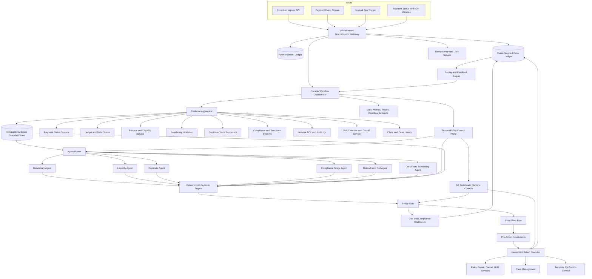

# Payment Exception Resolution Agent Golden Production Plan

This is the presentation-grade golden plan for a production Payment Exception Resolution Agent. It covers the complete system from exception ingress through investigation, decisioning, safe action execution, human review, audit, replay, latency management, multi-user operations, and rollout governance.

The winning architecture is an **event-sourced payment exception workflow with a deterministic policy and safety core, scoped read-only diagnostic agents, immutable evidence snapshots, and an idempotent side-effect executor**.

Agents help investigate and explain. They do not own money movement. The deterministic workflow, policy engine, safety gate, human approval model, and audit ledger own production correctness.

## 1. Executive recommendation

Build the system as a conservative payment operations control plane, not as an autonomous payment actor.

Recommended production stance:

1. **Automate investigation first**: collect evidence, classify root cause, summarize, route, and recommend.
2. **Automate safe non-financial work next**: case creation, queue routing, holds, deferrals, compliance escalation, and approved template-based outreach tasks.
3. **Automate financial actions only in narrow, certified cohorts**: retry, repair, or duplicate cancellation require deterministic policy approval, rail-specific finality, payment-intent locking, pre-action revalidation, full audit, and risk/compliance sign-off.
4. **Never automate compliance release** inside this agentic workflow. Compliance release remains in the authoritative compliance platform with appropriate controls.

The system optimizes for **safe resolution under uncertainty**, not maximum automation.

## 2. Architecture decision and alternatives

### 2.1 Decision

Use a **durable, event-sourced workflow** where:

- A canonical ingress event starts or resumes a case.
- A payment-intent ledger prevents duplicate payment actions across channels.
- An evidence aggregator creates immutable, bitemporal evidence snapshots.
- A policy engine loads trusted rail, country, currency, amount, client, and exception rules.
- Scoped diagnostic agents receive only agent-safe snapshot slices.
- A deterministic decision engine merges evidence, policy, and recommendations.
- A safety gate blocks unsafe outcomes regardless of agent confidence.
- A side-effect executor performs only approved actions using idempotency keys and pre-action revalidation.
- Human operators work through queues with RBAC, case leases, maker-checker controls, and full override audit.
- Every state transition is appended to an immutable audit ledger and can be replayed.

### 2.2 Alternatives considered

| Alternative | Strength | Why it loses |
|---|---|---|
| Single autonomous agent | Simple demo, flexible reasoning | Too much authority in one probabilistic component, weak determinism, difficult audit, unsafe for financial side effects |
| Agent-to-agent workflow where agents execute tools | Fast remediation path | Agents would control side effects, increasing duplicate payment, wrong repair, and compliance leakage risk |
| Pure deterministic rules engine | Maximum auditability and certification | Less adaptive for investigation summaries, ambiguous evidence explanation, and operational triage. Still useful as the safety core |
| Human-only operations with AI summaries | Lowest automation risk | Does not reduce cycle time enough and leaves duplicate manual effort at scale |
| Central workflow with read-only agents and deterministic policy core | Balances investigation speed, auditability, safety, and controlled automation | Chosen architecture |

### 2.3 Defense of the decision

The chosen architecture wins because it separates **diagnosis** from **authority**:

- Agents can be useful without being trusted to move money.
- Deterministic policy makes the same evidence set produce the same decision.
- Evidence snapshots make decisions replayable even when source systems later change.
- Payment-intent locking and side-effect idempotency prevent duplicate financial actions.
- Human review is not a fallback failure. It is a first-class safe outcome.
- Latency is controlled by explicit synchronous and asynchronous budgets rather than waiting indefinitely for every dependency.

## 3. Goals, non-goals, and assumptions

### Goals

- Diagnose likely root cause for failed, held, uncertain, or delayed payments.
- Handle incorrect beneficiary details, insufficient funds, duplicate submissions, compliance holds, network or rail failures, cut-off misses, and uncertain retry outcomes.
- Decide whether the case can be resolved automatically, needs client input, needs operations review, needs compliance review, or must wait for reconciliation.
- Execute only approved side effects with idempotency, locking, audit, and replay.
- Support high-volume, multi-user operations with predictable latency and safe degraded modes.

### Non-goals

- Replacing the core payment engine or ledger.
- Replacing authoritative compliance systems.
- Building a full customer portal.
- Solving every rail-specific field-level validation rule in this document. The design supports rail-specific policy packs and adapters.

### Assumptions

- Authoritative source systems exist for payment status, ledger state, compliance status, network acknowledgements, beneficiary validation, duplicate trace, balance/liquidity, case management, and communications.
- Financial automation starts disabled and is enabled only after replay, shadow, assisted, and non-financial automation phases meet explicit gates.
- Compliance data may be restricted. General agents and operators receive redacted views unless explicitly entitled.

## 4. Production principles

1. **Fail closed for compliance**: any compliance signal, missing compliance evidence, or disclosure risk forces hold or compliance escalation.
2. **No retry under uncertainty**: unknown funds movement, unknown finality, conflicting evidence, or uncertain prior retry status blocks retry.
3. **No duplicate side effects**: ingress, case creation, evidence snapshots, agent invocations, decisions, action plans, attempts, and replays all require idempotency keys.
4. **Agents are read-only**: agents cannot retry, cancel, repair, release, notify, mutate cases, or fetch arbitrary external data.
5. **Policy is trusted, events are not**: runtime controls come from the policy control plane, not from untrusted event payloads.
6. **Decisioning is deterministic**: same event, same evidence snapshot, same policy version, and same accepted agent outputs produce the same final decision.
7. **Safety gate overrides all recommendations**: hard safety rules beat confidence scores, operator convenience, and business pressure.
8. **Human review is a success path**: safe escalation is better than unsafe automation.
9. **Every decision is replayable**: store event, evidence, source versions, policy version, agent version, prompts if any, decision, action attempts, operator overrides, and final outcomes.
10. **Latency is budgeted, not hoped for**: synchronous diagnosis returns within a defined SLO or transitions to asynchronous investigation.
11. **Multi-user operations require concurrency control**: operator edits, approvals, queue claims, and replays use leases, optimistic versioning, and maker-checker controls.
12. **Financial automation must be reversible or extremely constrained**: start with low-value, low-risk, rail-certified cohorts and kill switches.

## 5. End-to-end production architecture



## 6. Component responsibilities

| Component | Responsibility | Production notes |
|---|---|---|
| Validation and Normalization Gateway | Validate schema, normalize rail payloads, assign trace IDs, reject malformed events | Stateless, horizontally scalable, no side effects before idempotency |
| Payment Intent Ledger | Canonical identity for the business intent behind payments and retries | Prevents duplicate actions across API, file upload, branch ops, manual ops, scheduled retry, and replay |
| Event-Sourced Case Ledger | Append-only case events and current case projection | Source of truth for case state, audit, replay, and operator concurrency |
| Idempotency and Lock Service | Conditional inserts, workflow leases, payment-intent locks, action idempotency | Uses DB constraints or strongly consistent store for financial actions |
| Durable Workflow Orchestrator | Timeouts, retries, parallel evidence gathering, state transitions, replay | Temporal, Cadence, Step Functions, or equivalent durable workflow engine |
| Evidence Aggregator | Collects source facts, freshness, bitemporal timestamps, conflicts, and raw evidence references | Agents never fetch arbitrary source data |
| Immutable Evidence Snapshot Store | Stores canonicalized, hashed evidence snapshots | Raw restricted evidence may live in a separate restricted store |
| Policy Control Plane | Trusted policy, thresholds, rail rules, rollout cohorts, ownership maps, freshness budgets, kill switches | Versioned, schema-validated, auditable, runtime-overridable by authorized users |
| Agent Router | Selects which agents run and with what scoped context | Supports parallel execution within latency budgets |
| Diagnostic Agents | Produce structured recommendations, reason codes, evidence gaps, and explanations | Read-only and schema-bound |
| Deterministic Decision Engine | Merges evidence, policy, and agent outputs into a final decision | No LLM dependence for financial eligibility |
| Safety Gate | Applies hard rules, action eligibility, approvals, and kill switches | Last deterministic barrier before action planning |
| Ops and Compliance Workbench | Human queues, case review, approvals, overrides, and maker-checker | Multi-user safe with leases, RBAC, and audit |
| Pre-Action Revalidation | Refreshes critical state immediately before a side effect | Required for retry, repair, cancel, release-like actions, and high-risk notifications |
| Idempotent Action Executor | Executes approved actions and tracks attempts through lifecycle | Exactly-once is not assumed. Reconciliation confirms outcome |
| Replay and Feedback Engine | Reopens cases when new evidence, status, outcomes, or human overrides arrive | Never overwrites prior decisions |
| Observability Stack | Logs, metrics, traces, queue views, SLOs, alerts, incident dashboards | Separate views for engineering, ops, risk, compliance, and executives |

## 7. Agent catalogue and boundaries

Agents are investigation specialists. Each agent receives a versioned envelope with a scoped `context`, evidence snapshot ID, policy version, deadline, permissions, and redaction profile.

Common contract:

```json
{
  "schema_version": "agent-invocation-1.0",
  "invocation_id": "inv-001",
  "case_id": "case-pay-001",
  "payment_id": "pay-001",
  "payment_intent_id": "intent-001",
  "evidence_snapshot_id": "snap-001",
  "policy_version": "payments-policy-2026-06-01",
  "agent_name": "NetworkRailAgent",
  "agent_version": "1.0.0",
  "created_at": "2026-06-09T06:00:06Z",
  "deadline_at": "2026-06-09T06:00:09Z",
  "permissions": {
    "can_read_external_systems": false,
    "can_execute_side_effects": false,
    "allowed_data_classes": ["OPS_SAFE", "PAYMENT_SUMMARY"]
  },
  "context": {}
}
```

Common output:

```json
{
  "schema_version": "agent-recommendation-1.0",
  "invocation_id": "inv-001",
  "agent_name": "NetworkRailAgent",
  "agent_version": "1.0.0",
  "case_id": "case-pay-001",
  "evidence_snapshot_id": "snap-001",
  "classification": "network_uncertain_finality",
  "recommended_action": "HOLD_AND_RECONCILE",
  "automation_eligible": false,
  "confidence": 0.93,
  "risk_level": "HIGH",
  "reason_codes": ["NETWORK_ACK_MISSING", "FINALITY_UNKNOWN"],
  "evidence_facts": ["network_finality=UNKNOWN", "ledger_debit_status=DEBIT_PENDING"],
  "evidence_gaps": ["missing_final_ack"],
  "unsafe_actions_blocked": ["RETRY_PAYMENT"],
  "explanation": "Network acknowledgement is missing and ledger debit is pending, so retry could create duplicate movement.",
  "next_steps": ["Wait for rail acknowledgement", "Open reconciliation task"],
  "output_valid_until": "2026-06-09T06:10:06Z"
}
```

| Agent | Purpose | Inputs | Allowed recommendations | Must defer |
|---|---|---|---|---|
| Beneficiary Agent | Diagnose invalid account, UPI, routing, IFSC, or beneficiary mismatch | Beneficiary validation, masked details, payment summary, client history | Request correction, deterministic repair candidate, manual review | Any repair without deterministic validation and client or policy approval |
| Liquidity Agent | Diagnose insufficient funds, debit failure, balance timing, account restrictions | Balance evidence, account state, debit attempts, payment amount, client segment | Notify insufficient funds, retry when funds available, hold, manual review | Debit, retry, or notification if compliance-sensitive |
| Duplicate Agent | Detect duplicate instructions across channels and retries | Payment intent, duplicate trace, client references, beneficiary fingerprint, amount, timestamps | Cancel current duplicate, hold duplicate, manual review | Cancellation when current payment finality or cancellability is ambiguous |
| Compliance Triage Agent | Summarize compliance status and route restricted cases | Redacted compliance status, hold type, allowed queue metadata | Escalate compliance, hold, block client disclosure | Compliance release, detailed sanctions explanation to general ops or client |
| Network and Rail Agent | Diagnose rail outage, ACK gaps, uncertain finality, settlement windows | Network logs, rail status, ACKs, ledger state, retry history | Hold and reconcile, safe retry candidate, incident route | Retry if finality, funds movement, or prior retry outcome is unknown |
| Cut-off and Scheduling Agent | Detect missed cut-off, holiday calendar, rail window, next available processing | Rail calendar, submission time, region, currency, service-level rules | Requeue for next window, client communication task, manual review | Same-day promise or resubmission outside allowed rail window |
| Communication Triage Agent | Select safe template and disclosure level for client or internal updates | Case state, compliance sensitivity flag, approved templates, client preferences | Draft notification task, suppress notification, route for review | Free-form client communication, compliance-sensitive disclosure |

## 8. Canonical data model

### 8.1 Ingress event

Ingress events are factual inputs, not trusted controls. They may include hints, but not authoritative thresholds, kill switches, or policy decisions.

```json
{
  "schema_version": "payment-exception-event-1.0",
  "event": {
    "event_id": "evt-001",
    "event_version": 1,
    "event_type": "PAYMENT_EXCEPTION_CREATED",
    "event_timestamp": "2026-06-09T06:00:01Z",
    "source_system": "payment-orchestrator",
    "correlation_id": "corr-abc",
    "causation_id": "payment-submit-xyz",
    "idempotency_key": "payment-orchestrator:evt-001:1"
  },
  "payment": {
    "payment_id": "pay-001",
    "payment_version": 3,
    "payment_intent_id": "intent-001",
    "client_id": "client-123",
    "client_segment": "COMMERCIAL",
    "client_reference": "INV-7788",
    "account_id_token": "acct_tok_456",
    "payment_rail": "UPI",
    "payment_type": "OUTBOUND_TRANSFER",
    "amount": "12500.50",
    "currency": "INR",
    "submitted_timestamp": "2026-06-09T06:00:00Z",
    "current_transaction_status": "FAILED",
    "status_last_updated_at": "2026-06-09T06:00:01Z"
  },
  "parties": {
    "originator": {"client_id": "client-123", "country": "IN"},
    "beneficiary": {
      "beneficiary_id": "bene-789",
      "name_masked": "A*** R**",
      "account_number_token": "acct_tok_bene_7890",
      "account_number_masked": "XXXXXX7890",
      "ifsc": "HDFC0001234",
      "upi_id_token": "upi_tok_123",
      "upi_id_masked": "a***@upi",
      "country": "IN",
      "beneficiary_fingerprint": "benehash-abc123"
    }
  },
  "exception": {
    "exception_id": "ex-001",
    "exception_code": "INVALID_BENEFICIARY",
    "exception_category_hint": "BENEFICIARY",
    "description": "Beneficiary validation failed",
    "severity": "MEDIUM",
    "detected_at": "2026-06-09T06:00:01Z"
  },
  "evidence_references": {
    "payment_status_ref": "status-ref-001",
    "ledger_ref": "ledger-ref-001",
    "balance_ref": "balance-ref-001",
    "beneficiary_validation_ref": "bene-val-ref-001",
    "duplicate_trace_ref": "dup-ref-001",
    "compliance_screening_ref": "screen-ref-001",
    "network_ack_ref": "network-ref-001",
    "rail_calendar_ref": "rail-cal-ref-001",
    "client_contact_ref": "contact-ref-001"
  },
  "data_classification": {
    "contains_pii": true,
    "contains_compliance_sensitive_data": false,
    "redaction_profile_hint": "ops-safe-v1"
  }
}
```

### 8.2 Trusted policy context

Policy context is loaded by the platform after ingress. It is not accepted from event producers.

```json
{
  "policy_version": "payments-policy-2026-06-01",
  "automation_mode": "ASSISTED_OPERATIONS",
  "rail": "UPI",
  "country": "IN",
  "currency": "INR",
  "client_segment": "COMMERCIAL",
  "amount_band": "LOW_VALUE",
  "enabled_actions": ["CREATE_CASE", "HOLD", "COMPLIANCE_ESCALATION", "CLIENT_OUTREACH_TASK"],
  "disabled_actions": ["COMPLIANCE_RELEASE"],
  "thresholds": {
    "manual_review_threshold": 0.75,
    "safe_retry_threshold": 0.97,
    "duplicate_cancel_threshold": 0.95,
    "beneficiary_repair_threshold": 0.98
  },
  "freshness_budgets_ms": {
    "payment_status": 2000,
    "ledger": 2000,
    "balance": 2000,
    "compliance": 5000,
    "network_ack": 10000,
    "duplicate_trace": 5000,
    "rail_calendar": 86400000
  },
  "approval_rules": {
    "high_value_threshold": "100000.00",
    "requires_maker_checker": ["RETRY_PAYMENT", "BENEFICIARY_REPAIR", "DUPLICATE_CANCEL"],
    "compliance_cases_require_compliance_queue": true
  },
  "kill_switches": {
    "global_financial_automation_disabled": true,
    "rail_automation_disabled": false,
    "client_cohort_disabled": false,
    "action_type_disabled": []
  },
  "ownership": {
    "ops_queue": "payments-ops-l2",
    "compliance_queue": "compliance-sanctions-l1",
    "network_queue": "network-ops"
  },
  "latency_budgets_ms": {
    "primary_diagnosis": 2000,
    "agent_invocation_sync": 500,
    "financial_pre_action_revalidation": 1000
  }
}
```

### 8.3 Evidence snapshot

The evidence snapshot captures what the system knew at decision time. It separates raw restricted evidence from agent-safe facts.

```json
{
  "schema_version": "evidence-snapshot-1.0",
  "evidence_snapshot_id": "snap-001",
  "case_id": "case-pay-001",
  "payment_id": "pay-001",
  "payment_intent_id": "intent-001",
  "created_at": "2026-06-09T06:00:05Z",
  "canonicalization_version": "evidence-canon-1.0",
  "snapshot_hash": "sha256:snapshot-hash",
  "freshness_status": "PARTIAL",
  "source_results": [
    {
      "source_name": "ledger",
      "status": "AVAILABLE",
      "source_observed_at": "2026-06-09T06:00:04Z",
      "source_effective_at": "2026-06-09T06:00:03Z",
      "collected_at": "2026-06-09T06:00:05Z",
      "source_version_or_cursor": "ledger-offset-991",
      "latency_ms": 120,
      "staleness_ms": 1000,
      "fresh_enough_for_actions": ["CREATE_CASE", "HOLD"],
      "not_fresh_enough_for_actions": ["RETRY_PAYMENT"],
      "raw_payload_ref": "restricted://ledger/991",
      "agent_safe_data_hash": "sha256:ledger-safe-hash"
    }
  ],
  "facts": {
    "ledger_debit_status": "NOT_DEBITED",
    "funds_movement_status": "NO_FUNDS_MOVED",
    "network_finality": "FINAL_FAILED",
    "beneficiary_validation_status": "FAILED",
    "duplicate_candidate_count": 0,
    "compliance_hold_status": "NONE",
    "balance_sufficient": true,
    "cutoff_window_status": "OPEN"
  },
  "authoritative_source_ranking": ["ledger", "payment_status", "network_ack", "case_history"],
  "conflicts": [],
  "missing_sources": [],
  "redaction_profile": "agent-safe-v1"
}
```

Evidence source statuses:

| Status | Meaning | Side-effect rule |
|---|---|---|
| `AVAILABLE` | Source responded and is fresh enough for requested action | May be used if action matrix allows |
| `PARTIAL` | Source responded with incomplete data | Non-financial decisions only unless policy explicitly allows |
| `STALE` | Data exceeds freshness budget | Block financial actions that depend on it |
| `UNAVAILABLE` | Source timed out or failed | Fail closed for dependent actions |
| `CONFLICTING` | Source contradicts higher or peer authority | Reconcile or manual review |

### 8.4 Canonical finality model

Financial actions depend on finality, not on generic statuses like `FAILED`.

| Finality state | Meaning | Retry allowed | Cancel allowed | Repair allowed |
|---|---|---:|---:|---:|
| `NOT_SUBMITTED` | Payment did not reach rail or ledger debit | Maybe, if no duplicate risk | Not applicable | Maybe before submission |
| `SUBMITTED_NOT_ACKED` | Submitted but no authoritative ACK | No | Only if rail confirms cancellable | No |
| `ACKED_NON_FINAL` | Rail accepted but outcome pending | No | Rail-specific, usually manual | No |
| `FINAL_FAILED_NO_FUNDS_MOVED` | Final failure and ledger confirms no movement | Yes, if other gates pass | Not applicable | Maybe |
| `FINAL_FAILED_FUNDS_MOVED` | Failure with debit, suspense, nostro, or beneficiary movement | No | Manual reconciliation | No |
| `FINAL_SUCCESS` | Payment completed | No | No, use recall/reversal process if needed | No |
| `FINAL_CANCELLED` | Cancel confirmed effective | No retry without new intent | No | No |
| `UNKNOWN_CONFLICTING` | Sources disagree or finality cannot be proven | No | No automated cancellation | No |

### 8.5 Side-effect plan and attempt lifecycle

Exactly-once side effects are impossible across distributed systems. The system provides at-most-once intent plus reconciliation.

```json
{
  "schema_version": "side-effect-plan-1.0",
  "plan_id": "plan-001",
  "case_id": "case-pay-001",
  "decision_id": "decision-001",
  "action_type": "RETRY_PAYMENT",
  "target_id": "payment_intent:intent-001",
  "idempotency_key": "case-pay-001:retry:intent-001:v1",
  "required_pre_action_checks": ["ledger_fresh", "network_finality_final_failed", "duplicate_lock_acquired", "compliance_clear"],
  "approval_state": "APPROVED_BY_POLICY",
  "expires_at": "2026-06-09T06:05:00Z"
}
```

Attempt states:

```text
PLANNED -> APPROVED -> PRE_ACTION_REVALIDATED -> SUBMITTED -> ACCEPTED_BY_DOWNSTREAM -> CONFIRMED_EFFECTIVE
                                                          |-> FAILED_RETRYABLE
                                                          |-> FAILED_TERMINAL
                                                          |-> OUTCOME_UNKNOWN_RECONCILIATION_REQUIRED
                                                          |-> COMPENSATION_REQUIRED
```

Rules:

- Never create a new side-effect idempotency key after a timeout.
- If downstream outcome is unknown, stop new financial actions and reconcile.
- Confirmation is separate from submission.
- Compensation paths are predefined for wrong retry, wrong cancellation, wrong beneficiary repair, compliance disclosure, and duplicate debit.

## 9. Orchestration workflow

### 9.1 High-level flow

1. Receive exception event or manual trigger.
2. Validate schema and normalize rail-specific fields.
3. Check ingress idempotency.
4. Resolve or create payment intent.
5. Acquire case lease or resume existing case.
6. Append `ExceptionReceived` to case ledger.
7. Load trusted policy context.
8. Gather evidence in parallel within budget.
9. Create immutable evidence snapshot.
10. Route to one or more diagnostic agents.
11. Validate agent outputs.
12. Merge evidence, policy, and agent outputs deterministically.
13. Apply safety gate.
14. Produce final decision: action plan, manual queue task, defer/reconcile, or no-op.
15. For side effects, perform pre-action revalidation and execute with idempotency.
16. Update case projection and append audit events.
17. Register replay triggers for new ACKs, status changes, retry outcomes, operator overrides, client responses, and policy backtests.

### 9.2 Pseudocode

```python
def handle_exception(event):
    validate_event_schema(event)
    if ingress_seen(event.idempotency_key):
        return existing_case_status(event.idempotency_key)

    intent = payment_intent_ledger.resolve_or_create(event)
    with lock_service.case_lease(intent.id, event.exception_id):
        case = case_ledger.create_or_resume(intent, event)
        policy = policy_store.load_trusted_context(event, intent)
        if policy.kill_switches.global_financial_automation_disabled:
            policy = policy.force_recommendation_or_assisted_mode()

        snapshot = evidence_aggregator.collect_parallel(
            event=event,
            policy=policy,
            latency_budget=policy.primary_diagnosis_budget_ms,
        )
        case_ledger.append("EvidenceSnapshotCreated", snapshot.hash)

        agent_outputs = agent_router.invoke_allowed_agents(snapshot, policy)
        valid_outputs = validate_and_filter(agent_outputs)

        decision = decision_engine.decide(
            event=event,
            intent=intent,
            snapshot=snapshot,
            policy=policy,
            recommendations=valid_outputs,
        )
        gated = safety_gate.apply(decision, snapshot, policy)
        case_ledger.append("DecisionRecorded", gated)

        if gated.requires_human_review:
            return ops_workbench.enqueue(gated)

        if gated.has_side_effect_plan:
            fresh = pre_action_revalidator.recheck(gated.side_effect_plan)
            if not fresh.safe:
                return ops_workbench.enqueue_reconciliation(fresh.reason)
            return action_executor.execute(gated.side_effect_plan)

        return gated.summary
```

### 9.3 Egress and async post-decision outputs

The system has separate egress paths for synchronous callers, operators, downstream payment systems, clients, and audit consumers:

| Egress target | Output | Safety rule |
|---|---|---|
| Synchronous API caller | Case ID, current decision status, safe explanation, next expected update | Never exposes restricted compliance details |
| Payment or retry service | Approved side-effect plan with idempotency key and pre-action revalidation result | Financial actions only after safety gate and locks |
| Case-management system | Queue task, SLA, owner, evidence links, reason codes, blocked actions | Uses role-specific redaction profile |
| Compliance platform | Compliance escalation packet and restricted evidence references | Compliance release stays in compliance platform |
| Client communication service | Approved template ID, allowed variables, disclosure restrictions | No free-form compliance-sensitive outreach |
| Monitoring and audit systems | Append-only case events, metrics, traces, action outcomes | Audit write must succeed before side effects |

Async follow-up continues after the primary decision path for rail acknowledgements, retry outcomes, client responses, operator overrides, policy backtests, incident-linked bulk updates, and stale queue escalation. Each async update appends a new case event and may trigger replay, but it cannot overwrite prior decisions or repeat side effects without a new approved action version.

## 10. Latency, throughput, and scale design

### 10.1 Latency SLOs

| Path | Target | Behavior if budget exceeded |
|---|---:|---|
| Ingress validation and idempotency | p95 < 150 ms | Reject malformed, return existing case, or enqueue async case |
| Primary synchronous diagnosis | p95 < 2 seconds, p99 < 5 seconds | Return case ID with `INVESTIGATION_PENDING`; continue async |
| Evidence collection per fast source | p95 < 500 ms | Mark source unavailable or stale if not critical |
| Compliance evidence | p95 < 3 seconds | Fail closed with compliance hold if unavailable |
| Agent invocation | p95 < 1 second per agent, hard timeout 3 seconds | Discard timed-out output and route via deterministic fallback |
| Decision and safety gate | p95 < 100 ms | If policy unavailable or decision fails, manual review |
| Non-financial action execution | p95 < 2 seconds | Retry with same idempotency key, then dead-letter |
| Financial action submission | p95 depends on rail | Track as async until confirmed effective |
| Operator case load | p95 case page load < 1 second | Use projections, pagination, and cached read models |

### 10.2 Budget sharing

The primary diagnosis budget is divided explicitly:

| Stage | Default budget |
|---|---:|
| Gateway and idempotency | 150 ms |
| Policy load | 100 ms |
| Parallel evidence gathering | 1100 ms |
| Agent invocations | 500 ms synchronous budget, longer async allowed for assisted mode |
| Decision and safety | 100 ms |
| Response packaging | 50 ms |

If the system cannot gather enough evidence within the synchronous budget, it returns a safe pending outcome and continues asynchronously. It does not extend the request until unsafe timeouts happen.

### 10.3 Parallelism

- Payment status, ledger, duplicate trace, beneficiary validation, compliance status, rail status, balance, and cut-off calendar are fetched in parallel.
- Compliance, ledger, and finality evidence are hard gates for financial actions.
- Slower sources can arrive later and trigger replay.
- Agent invocations run in parallel only after the snapshot is created.
- The decision engine can issue partial, non-financial decisions with partial evidence.

### 10.4 Throughput and backpressure

The design supports horizontal scaling by separating stateless API, workflow workers, evidence adapters, agent workers, policy service, read projections, and action executors.

Backpressure controls:

- Priority queues by severity, payment value, client tier, compliance sensitivity, and rail incident.
- Per-client and per-rail rate limits.
- Circuit breakers for unstable dependencies.
- Bulkheads between compliance, network, beneficiary, duplicate, and communication workloads.
- Dead-letter queues for malformed events, unrecoverable action attempts, replay loops, and stuck cases.
- Autoscaling on queue depth, workflow latency, and evidence adapter saturation.

### 10.5 Availability and disaster recovery

| Capability | Target |
|---|---|
| Ingress API availability | 99.9 percent or aligned to bank platform SLO |
| Case ledger durability | No acknowledged audit event loss |
| RPO | 0 for case ledger and idempotency records, near-zero via synchronous replication if required |
| RTO | Under 1 hour for regional recovery, stricter if required by bank operations |
| Degraded mode | Recommendation-only or manual-review mode when dependencies fail |
| Replay after recovery | Rehydrate from event log and rebuild projections |

## 11. Multi-user and multi-tenant operations

### 11.1 Operator concurrency

Multiple users may view, claim, comment on, approve, or override the same case. The workbench must implement:

- Case leases with expiration and renewal.
- Optimistic concurrency using `case_version` or event sequence number.
- Immutable comments and decision notes.
- Standardized override reason codes plus optional narrative.
- Maker-checker for high-value or financial actions.
- Separation of duties between maker, checker, compliance reviewer, and engineering/admin roles.
- Real-time case update notifications to avoid stale decisions.
- Audit of who saw restricted data, who changed state, and who approved actions.

### 11.2 RBAC and entitlement model

| Role | Can view | Can recommend | Can approve | Cannot do |
|---|---|---|---|---|
| Payments Ops L1 | Ops-safe case summary | Client outreach task, manual review notes | Low-risk non-financial queue updates | View restricted sanctions details, approve financial actions |
| Payments Ops L2 | Ops details and evidence links | Retry or repair recommendation | Low-value financial action if policy allows and maker-checker satisfied | Compliance release |
| Compliance Analyst | Compliance-safe case view | Hold, escalation, release recommendation in compliance system | Compliance workflow actions in authoritative platform | Direct payment retry or repair |
| Network Ops | Rail incident and ACK details | Reconcile, wait, incident routing | Rail incident resolution workflow | Client communication involving compliance |
| Risk Approver | Risk dashboard and sampled cases | Policy changes | Cohort automation approval | Direct case mutation without audit |
| System Admin | Operational config | N/A | Kill switch activation by entitlement | Payment action approval without business role |

### 11.3 Multi-client and data isolation

- Tenant/client data is partitioned logically and protected by entitlement checks.
- Client-specific policy overrides are versioned and auditable.
- Queue views enforce client segmentation and restricted client flags.
- Metrics can aggregate across clients only after privacy rules allow it.
- Bulk client outages or file-upload duplicates can be managed as incident-level parent cases linked to child payment cases.

### 11.4 Human queue model

| Queue | Owner | Typical cases | SLA inputs |
|---|---|---|---|
| Payments Ops L1 | Payment operations | Missing client data, simple beneficiary correction, client outreach | Client tier, value, age, severity |
| Payments Ops L2 | Senior payments ops | Retry, repair, duplicate cancellation review | Value, rail, finality, duplicate risk |
| Compliance | Compliance operations | Sanctions, AML, restricted disclosure | Regulatory criticality, jurisdiction |
| Network Ops | Rail operations | ACK gaps, rail outage, reconciliation | Rail incident severity, settlement window |
| Tech Ops | Engineering support | Dependency failure, replay loop, stuck workflow | Incident severity, system impact |
| Treasury/Liquidity | Treasury or account ops | Insufficient funds, liquidity timing, account restrictions | Client tier, funding status, amount |

## 12. Payment-state and action eligibility matrix

### 12.1 Authoritative source hierarchy

When sources conflict, the decision engine uses a configured hierarchy by fact type:

| Fact | Primary authority | Secondary sources | Conflict behavior |
|---|---|---|---|
| Customer ledger debit | Core ledger | Payment status, reconciliation | Ledger wins, conflict blocks financial actions |
| Rail finality | Rail ACK or clearing network | Payment orchestrator, network logs | Unknown or conflicting finality blocks retry/cancel |
| Beneficiary validation | Authoritative validation service or directory | Client profile, historical successful payments | Conflict requires client or ops review |
| Compliance hold | Compliance platform | Payment status flag, case notes | Any hold or unavailable compliance evidence fails closed |
| Duplicate intent | Payment intent ledger and duplicate trace | Client reference, amount, beneficiary fingerprint | Candidate duplicate blocks retry |
| Cut-off eligibility | Rail calendar and policy | Orchestrator schedule | Missed or ambiguous window defers or requeues |
| Balance sufficiency | Core account and balance system | Ledger, account restrictions | Unavailable balance blocks insufficient-funds retry |

### 12.2 Action eligibility

| Action | Required finality/evidence | Approval | Never allowed when |
|---|---|---|---|
| Create ops case | Valid event or manual trigger | Policy | Audit unavailable |
| Hold or defer | Uncertainty, compliance signal, rail issue, or policy rule | Policy, sometimes compliance | Audit unavailable |
| Client outreach task | Approved template, disclosure check, no restricted compliance conflict | Ops or policy depending on template | AML/sanctions sensitivity blocks disclosure |
| Compliance escalation | Any compliance signal or unavailable compliance evidence | Automatic | Never blocked by low confidence |
| Requeue after cut-off | Finality proves not executed, rail calendar confirms next window | Policy or ops | Compliance hold, duplicate risk, unclear debit |
| Retry insufficient funds | Prior attempt final failed, no funds moved, balance now sufficient, no duplicate risk | Policy plus maker-checker for configured cases | Unknown finality, compliance hold, high value without approval |
| Retry network failure | Final failed no funds moved, no duplicate risk, rail healthy | Policy plus maker-checker for configured cases | Missing ACK, ACK pending, rail incident active |
| Beneficiary repair | Deterministic correction, client or directory authority, no funds moved | Client confirmation or ops approval | Changing standing beneficiary without authorization |
| Cancel duplicate | Original confirmed success, current duplicate cancellable and non-final, rail supports cancellation | Maker-checker | Current payment final, cancellation best-effort only without manual approval |
| Compliance release | Not supported in this system | Compliance platform only | Always blocked here |

## 13. Decision engine and safety gate

### 13.1 Deterministic merge order

The decision engine merges recommendations in this order:

1. Compliance status and disclosure restrictions.
2. Ledger debit and funds movement.
3. Network or rail finality.
4. Duplicate intent and cross-channel duplicate candidates.
5. Payment value, client tier, jurisdiction, and policy cohort.
6. Evidence conflicts, freshness, and missing required sources.
7. Exception-specific agent recommendations.
8. Confidence thresholds and recommendation validity.
9. Human overrides from current case version.
10. Runtime kill switches.

Tie-breaking rule: choose the safer outcome. The order of safety from safest to riskiest is generally `COMPLIANCE_ESCALATE`, `HOLD_AND_RECONCILE`, `MANUAL_REVIEW`, `CLIENT_OUTREACH_TASK`, `REQUEUE`, `CANCEL_DUPLICATE`, `REPAIR`, `RETRY`.

### 13.2 Hard safety rules

| Rule | Result |
|---|---|
| Compliance hold exists | Force compliance escalation and block financial actions |
| Compliance evidence unavailable for a compliance-relevant case | Hold and escalate |
| Compliance-sensitive case with client outreach | Use approved disclosure template or suppress outreach |
| Funds movement unknown | Block retry, repair, and automated cancellation |
| Ledger unavailable | Block financial actions |
| Network finality not final | Block retry |
| Prior retry outcome unknown | Block retry and route to reconciliation |
| Duplicate candidate above threshold | Block retry |
| Duplicate cancellation candidate final or ambiguous | Block automated cancellation |
| Evidence conflict exists | Manual review or reconciliation |
| Required evidence stale for action | Block that action |
| Agent output invalid or expired | Discard output and use fallback |
| Policy config missing or invalid | Disable automation for affected route |
| Audit ledger unavailable | Stop before side effects |
| Payment intent lock unavailable | Block side effects |
| Rail, action, client, or global kill switch active | Block affected automation |
| High-value threshold exceeded | Require human approval or maker-checker |
| Operator approval stale against case version | Reject approval and require refresh |

### 13.3 Final decision schema

```json
{
  "schema_version": "final-decision-1.0",
  "decision_id": "decision-001",
  "case_id": "case-pay-001",
  "case_version": 12,
  "payment_id": "pay-001",
  "payment_intent_id": "intent-001",
  "evidence_snapshot_id": "snap-001",
  "policy_version": "payments-policy-2026-06-01",
  "decision_type": "HOLD_AND_RECONCILE",
  "automation_mode": "ASSISTED_OPERATIONS",
  "automation_eligible": false,
  "risk_level": "HIGH",
  "reason_codes": ["FINALITY_UNKNOWN", "RETRY_BLOCKED"],
  "blocked_actions": ["RETRY_PAYMENT"],
  "required_human_queue": "network-ops",
  "side_effect_plan_id": null,
  "explanation": "Rail finality is unknown and prior retry outcome is not confirmed. Retrying could duplicate funds movement.",
  "replay_triggers": ["NETWORK_ACK_RECEIVED", "LEDGER_STATUS_CHANGED"],
  "created_at": "2026-06-09T06:00:08Z"
}
```

## 14. Exception-specific resolution playbooks

### 14.1 Incorrect beneficiary details

- Validate beneficiary fields against rail-specific directory and historical successful payment patterns.
- If deterministic correction exists and payment was not submitted, create repair candidate.
- If correction requires client input, create client outreach task with approved template.
- If funds may have moved or beneficiary may have been credited, route to manual investigation.
- Never change standing beneficiary records without separate client authorization and audit.

### 14.2 Insufficient funds

- Check account balance, account restrictions, debit attempts, ledger state, and client funding history.
- If no debit occurred and balance is now sufficient, a retry can be recommended only after duplicate and compliance checks.
- If balance remains insufficient, notify or route according to client preferences and disclosure rules.
- If account restrictions exist, route to account ops or compliance as appropriate.

### 14.3 Duplicate payment submission

- Resolve payment intent across channels, not only by payment ID.
- Compare client reference, amount, currency, beneficiary fingerprint, submission window, file batch, standing instruction, and manual operations entries.
- If original is final success and current duplicate is confirmed cancellable and non-final, recommend cancellation with maker-checker.
- If both are in flight or finality is ambiguous, hold and reconcile.

### 14.4 Compliance or sanctions hold

- Compliance platform is authoritative.
- Any hold, unavailable evidence, or restricted indicator blocks financial actions.
- Client communication is suppressed or limited to approved neutral templates.
- Compliance release is outside this system.

### 14.5 Network or rail failure

- Gather ACKs, rail incident status, settlement window, ledger debit, and prior retry evidence.
- Unknown finality means hold and reconcile.
- Final failed with no funds moved may become a retry candidate after rail health recovers and policy allows.
- Active rail incident triggers incident-linked queue routing and throttling.

### 14.6 Cut-off time miss

- Check rail calendar, holiday schedule, cut-off, timezone, currency, and service-level promise.
- If payment was not submitted and no compliance/duplicate risk exists, requeue for next allowed window.
- If client expectation is impacted, create approved outreach task.
- If cut-off status conflicts with submission evidence, manual review.

### 14.7 Uncertain retry outcome

- Prior retry unknown blocks further retry.
- Reconcile ledger, rail ACK, payment status, and network logs.
- Register replay trigger for retry outcome arrival.
- If timeout persists beyond SLA, escalate to network ops or tech ops.

## 15. Idempotency, ordering, and locking

| Layer | Key | Purpose |
|---|---|---|
| Ingress | `source_system:event_id:event_version` | Prevent duplicate event processing |
| Payment intent | `client_id:client_reference:amount:currency:beneficiary_fingerprint:rail:business_date` plus configured variants | Detect same business payment across channels |
| Active case | `payment_intent_id:exception_type:rail_context` | Prevent duplicate active cases |
| Case event | `case_id:event_sequence` | Preserve deterministic case history |
| Evidence snapshot | `case_id:source_versions:policy_freshness_profile` | Avoid duplicate snapshots for same facts |
| Agent invocation | `case_id:agent_name:evidence_snapshot_id:agent_version` | Make agent outputs replayable |
| Decision | `case_id:evidence_snapshot_id:policy_version:decision_attempt` | Prevent conflicting decisions on same facts |
| Side effect | `case_id:action_type:target_id:action_version` | Prevent duplicate retry, cancel, repair, hold, or notification |
| Operator approval | `case_id:case_version:operator_id:approval_type` | Prevent stale or duplicate approval |
| Replay | `case_id:replay_reason:new_evidence_or_policy_id` | Prevent replay loops |

Ordering rules:

- Out-of-order events are appended but do not mutate current projection unless newer by source version or accepted replay policy.
- Late ACKs trigger replay instead of overwriting prior decisions.
- Financial action planning requires an exclusive payment-intent lock.
- Operator approvals are rejected if case version changed since the reviewer opened the case.
- Replays cannot repeat a side effect unless a new action version is approved and prior outcome is reconciled.

## 16. Audit, replay, and evidence retention

Audit events include:

- `ExceptionReceived`
- `CaseCreatedOrResumed`
- `PolicyLoaded`
- `EvidenceSnapshotCreated`
- `AgentInvoked`
- `AgentOutputValidated`
- `DecisionRecorded`
- `SafetyGateApplied`
- `HumanTaskCreated`
- `HumanOverrideRecorded`
- `SideEffectPlanned`
- `SideEffectSubmitted`
- `SideEffectConfirmed`
- `SideEffectOutcomeUnknown`
- `ReplayTriggered`
- `CaseClosed`

Audit requirements:

- Append-only event log with hash chaining or WORM-compatible storage.
- Operator identity, role, entitlement snapshot, approval chain, IP/device metadata where permitted, and timestamp.
- Raw restricted evidence stored separately from agent-safe snapshots.
- If LLMs are used, retain prompt template version, model version, parameters, redaction profile, and raw model output.
- Policy diffs show exactly which rule changed a decision during replay.
- Retention rules handle payment audit, compliance retention, privacy deletion, legal hold, and jurisdiction constraints.

Replay rules:

- Never overwrite prior decisions.
- Create a new decision version linked to replay reason.
- Use old snapshots for audit and new snapshots for current decisions.
- Cap automated replays, for example three per case before manual review.
- Replay side effects only through a new approved action version.

## 17. Security, privacy, and compliance controls

- Tokenize account numbers, account IDs, UPI IDs, and sensitive beneficiary identifiers.
- Mask values in logs, metrics, agent prompts, and general operations views.
- Use encryption in transit and at rest.
- Use least-privilege service identities and short-lived credentials.
- Separate restricted compliance evidence from general case evidence.
- Enforce data residency by jurisdiction and corridor.
- Maintain access logs for sensitive data reads.
- Use secrets manager for credentials.
- Apply prompt-injection controls for free-text client history, case notes, and external messages.
- Do not allow agents to generate executable action payloads without deterministic validation.
- Client outreach must use approved templates and disclosure controls.
- Tipping-off risk suppresses or restricts client communication.
- Compliance release occurs only in the authoritative compliance platform.

## 18. Observability and operating metrics

### 18.1 Logs and traces

Every workflow emits structured logs with:

- `trace_id`, `case_id`, `payment_id`, `payment_intent_id`, `client_id_token`, `rail`, `exception_type`
- `policy_version`, `evidence_snapshot_id`, `agent_versions`
- checkpoint name, latency, status, retry count, dependency status
- decision type, reason codes, safety blocks, side-effect state
- operator ID token and role for human actions

Distributed traces span ingress, idempotency, evidence adapters, agent calls, decision engine, safety gate, workbench, executor, and downstream services.

### 18.2 Metrics

| Category | Metrics |
|---|---|
| Latency | ingress latency, evidence latency by source, agent latency, decision latency, case page latency, side-effect confirmation time |
| Reliability | dependency timeout rate, stale evidence rate, conflicting evidence rate, workflow retry rate, replay loop count |
| Safety | blocked retry count, blocked cancellation count, pre-action revalidation failure count, duplicate side-effect attempt count |
| Financial risk | duplicate money movement confirmed, false retry count, false cancellation count, wrong beneficiary risk event, automation financial loss amount |
| Compliance | compliance misroute count, restricted disclosure block count, compliance SLA breach, compliance evidence unavailable count |
| Operations | manual queue depth, SLA breach by severity, mean time to resolve, override reason distribution, maker-checker pending count |
| Quality | agent invalid output rate, recommendation disagreement rate, replay changed decision count, audit reconstruction failure count |
| Rollout | cohort automation volume, kill switch activation duration, policy rule block count, canary case success rate |

### 18.3 Dashboards

- Engineering health: SLOs, dependency failures, workflow backlog, error budgets.
- Operations: queues, SLA, case aging, root-cause distribution, operator throughput.
- Risk: automation exposure, blocked actions, losses, near misses, policy exceptions.
- Compliance: hold volume, disclosure blocks, SLA, jurisdiction breakdown.
- Executive: volume, resolution time, automation rate, customer impact, safety incidents.

### 18.4 Alerts

- Audit ledger unavailable.
- Compliance system unavailable.
- Ledger unavailable or stale above threshold.
- Duplicate side-effect attempt detected.
- Confirmed duplicate money movement.
- False retry or false cancellation detected.
- Compliance misroute or restricted disclosure incident.
- Sudden spike in retry recommendations.
- Manual review queue SLA breach.
- Rail outage or ACK latency spike.
- Replay loop detected.
- Kill switch activated or failed to activate.
- Pre-action revalidation failures spike.

## 19. Incident response and kill switches

### 19.1 Kill switch scope

Kill switches must support:

- Global financial automation disable.
- Rail-specific disable.
- Action-specific disable, such as retry only.
- Client cohort disable.
- Currency or corridor disable.
- Agent disable.
- Dependency degraded-mode switch.
- Replay freeze.
- Notification suppression.

Activation and re-enable actions are audited. Re-enabling financial automation requires defined approval, and for severe incidents may require maker-checker or incident commander sign-off.

### 19.2 Incident severities

| Severity | Examples | Immediate containment |
|---|---|---|
| SEV-1 | Duplicate debit, wrong beneficiary movement, compliance release, data leak, audit loss | Disable affected automation, freeze replay, open war room, reconcile impacted cases |
| SEV-2 | Rail-wide outage, stuck action executor, high false recommendation rate | Disable affected rail/action, route to manual review, monitor backlog |
| SEV-3 | Single dependency degraded, queue SLA risk, agent invalid output spike | Degrade mode, reroute queue, alert owner |
| SEV-4 | Non-critical dashboard or template issue | Track and fix through normal change process |

### 19.3 Incident playbook

1. Detect via alert, operator report, or reconciliation.
2. Contain with scoped kill switch.
3. Identify impacted payment intents, cases, actions, and clients.
4. Freeze or quarantine uncertain side effects.
5. Reconcile ledger, rail, and downstream action status.
6. Decide client, regulator, risk, and compliance notifications through approved governance.
7. Compensate or reverse where required.
8. Backtest similar cases and policy conditions.
9. Record post-incident review and update policy/tests.
10. Re-enable only after sign-off and canary verification.

## 20. Deployment and rollout plan

### Phase 0: Offline replay

- Replay historical exceptions with no live side effects.
- Compare decisions with human outcomes and later payment truth.
- Build rail-specific finality mappings and policy packs.

Exit criteria:

- Audit reconstruction succeeds for sampled cases.
- No critical unsafe recommendation in reviewed samples.
- Decision validity above agreed threshold by exception type.
- Required evidence and finality model covers selected launch rails.

### Phase 1: Shadow mode

- Consume live events and produce decisions silently.
- No operator-facing recommendations and no side effects.
- Measure latency, dependency health, policy coverage, and drift.

Exit criteria:

- p95 primary diagnosis latency inside target or safe async fallback.
- Kill switches tested.
- Replay tested for late ACKs, policy changes, and operator truth labels.
- Zero SEV-1/SEV-2 safety findings in shadow decisions.

### Phase 2: Assisted operations

- Show recommendations to operations and compliance reviewers.
- Humans approve all actions.
- Capture override reasons and decision disagreement.

Exit criteria:

- Reduced investigation time without increased safety incidents.
- Low disagreement for non-financial actions.
- Override taxonomy stable.
- Operators trained and RBAC verified.

### Phase 3: Limited non-financial automation

- Automatically create cases, route queues, defer/hold, and escalate compliance.
- Generate client outreach tasks only from approved templates and disclosure checks.
- No automatic retry, repair, duplicate cancellation, or compliance release.

Exit criteria:

- No duplicate non-financial side effects.
- Complete audit coverage.
- Manual queue SLA improves or remains stable.
- Operations, compliance, risk, and engineering sign off.

### Phase 4: Guarded financial automation

- Enable one action at a time in narrow cohorts, starting with low-value, low-risk, reversible or highly constrained flows.
- Require rail-specific finality mapping, payment-intent locks, pre-action revalidation, maker-checker where configured, and active monitoring.

Exit criteria:

- Zero confirmed duplicate money movement caused by automation.
- False retry and false cancellation rates inside formally approved risk appetite.
- No compliance misroutes.
- Canary cases pass continuously.
- Independent sign-off from risk, compliance, legal if required, operations, engineering, information security, and model risk if LLMs are used.

## 21. Production readiness checklist

| Area | Required before financial automation |
|---|---|
| Finality | Rail-specific finality matrix certified for launch cohort |
| Evidence | Freshness budgets and authoritative source hierarchy configured |
| Idempotency | Payment-intent ledger, side-effect keys, and locks tested under concurrency |
| Policy | Versioned policy pack reviewed and signed off |
| Safety | Hard rules and action eligibility matrix tested |
| Human ops | Queues, SLAs, RBAC, maker-checker, and runbooks live |
| Observability | Dashboards, alerts, audit reconstruction, and canaries live |
| Incident response | Kill switches, containment, compensation, and restart criteria rehearsed |
| Security | Data masking, access logs, secrets, retention, and privacy controls validated |
| Model risk | Agent evals, prompt/version retention, and nondeterminism controls complete if LLMs are used |
| Load | Volume, burst, replay, and operator-concurrency tests passed |
| Backout | Automation can be disabled without losing case continuity |

## 22. Testing strategy

| Test type | Coverage |
|---|---|
| Schema tests | Ingress, policy, evidence snapshot, agent input/output, decision, action plan |
| Determinism tests | Same event/snapshot/policy produces same decision |
| Finality tests | Rail status mapping and action eligibility |
| Safety gate tests | Hard rules override unsafe recommendations |
| Idempotency tests | Duplicate events, duplicate actions, timeout retries, replay loops |
| Concurrency tests | Multi-operator approvals, stale case versions, concurrent events, payment-intent locks |
| Latency tests | p95/p99 budgets, slow dependencies, async fallback |
| Load tests | Burst events, queue depth, agent saturation, workbench users |
| Dependency failure tests | Unavailable, partial, stale, and conflicting evidence |
| Replay tests | Late ACK, status change, policy change, human override, no duplicate side effects |
| Audit tests | Full reconstruction from event ledger and evidence snapshots |
| Security tests | PII masking, RBAC, restricted compliance evidence, prompt-injection, secrets |
| Incident drills | Kill switches, rail outage, duplicate movement, audit store failure |
| User acceptance tests | Ops queue flow, maker-checker, escalation, override capture |

## 23. Sample end-to-end traces

### Trace A: Incorrect beneficiary requiring client outreach

1. Event arrives with `INVALID_BENEFICIARY`.
2. Gateway validates and creates case.
3. Evidence shows no funds moved, beneficiary validation failed, compliance clear, no duplicate.
4. Beneficiary Agent recommends client correction.
5. Decision engine selects `CLIENT_OUTREACH_TASK`.
6. Safety gate blocks retry and repair until corrected details arrive.
7. Workbench creates outreach task using approved template.
8. Client response triggers replay with new beneficiary evidence.

### Trace B: Insufficient funds later becomes retry candidate

1. Payment fails at debit with insufficient funds.
2. Evidence confirms no funds moved and balance insufficient.
3. Liquidity Agent recommends notify or wait.
4. Decision is `CLIENT_OUTREACH_TASK` or `HOLD_PENDING_FUNDS`.
5. Later balance update arrives.
6. Replay gathers fresh ledger, balance, duplicate, compliance, and finality evidence.
7. If no funds moved and policy allows, retry is proposed.
8. Pre-action revalidation confirms state and lock.
9. Executor submits retry with same action idempotency key and waits for confirmation.

### Trace C: Duplicate submission

1. Duplicate trace detects two payments with same client reference, amount, currency, and beneficiary fingerprint.
2. Original payment is final success.
3. Current duplicate is non-final but cancellability must be confirmed by rail.
4. If rail confirms cancellable, Duplicate Agent recommends cancel duplicate.
5. Safety gate requires maker-checker if amount or policy requires.
6. Executor submits cancellation and waits for confirmed effective status.
7. If cancellation outcome unknown, case routes to reconciliation.

### Trace D: Compliance hold

1. Payment exception has compliance hold status.
2. Evidence snapshot includes only redacted compliance facts for general agents.
3. Compliance Triage Agent recommends compliance escalation.
4. Safety gate blocks retry, repair, cancel, and free-form client outreach.
5. Compliance queue receives restricted case packet.
6. Any release decision occurs only in compliance platform.

### Trace E: Network finality unknown

1. Payment status says failed, but network ACK is missing and ledger debit is pending.
2. Network Agent recommends hold and reconcile.
3. Decision engine blocks retry because finality is unknown.
4. Case waits for ACK or ledger update.
5. Late ACK triggers replay.
6. If final failed no funds moved, retry may be considered. If success or funds moved, retry remains blocked.

### Trace F: Cut-off miss

1. Payment submitted after rail cut-off.
2. Evidence confirms not submitted to rail and ledger not debited.
3. Cut-off Agent recommends requeue to next available window.
4. Safety gate checks compliance, duplicate risk, and client notification policy.
5. Scheduler creates next-window task and optional approved outreach.
6. Replay occurs when scheduled submission result arrives.

## 24. Recommended technology choices

| Area | Recommendation |
|---|---|
| API | FastAPI, Spring Boot, or Node/NestJS depending on team standard |
| Workflow | Temporal, Cadence, Step Functions, or bank workflow platform |
| Eventing | Kafka, Pub/Sub, or internal bank event platform |
| Case ledger | PostgreSQL with append-only events, Kafka compacted topic plus DB projection, or event-store platform |
| Idempotency and locks | PostgreSQL constraints for moderate scale, strongly consistent KV or DB for high scale |
| Snapshot store | Object storage plus metadata DB, WORM-compatible if required |
| Read projections | PostgreSQL/OpenSearch depending on workbench query needs |
| Cache | Redis only for short-lived cache and leases where acceptable, never as source of truth |
| Policy | Versioned config in Git plus runtime feature flags and audited kill switches |
| Observability | OpenTelemetry, Prometheus, Grafana, centralized logs, alert manager |
| Secrets | Vault or cloud secret manager |
| Security | Tokenization service, encryption, RBAC/ABAC, audit logging |
| Testing | Contract tests, replay tests, finality tests, safety tests, chaos tests, concurrency tests |

## 25. Final stance

This plan is solid as the golden production architecture if presented with the explicit stance that **the agentic part investigates and explains, while deterministic controls authorize action**.

The most important design choice is not the number of agents. It is the control boundary:

```text
Evidence snapshot -> read-only agents -> deterministic decision -> safety gate -> human or idempotent executor -> immutable audit -> replay
```

A held payment with a clear explanation is better than an unsafe retry, duplicate debit, incorrect beneficiary repair, compliance disclosure, or accidental release.

The winning plan is conservative where money and compliance are at risk, fast where investigation can be parallelized, scalable for multi-user operations, and auditable enough to defend every decision after the fact.
