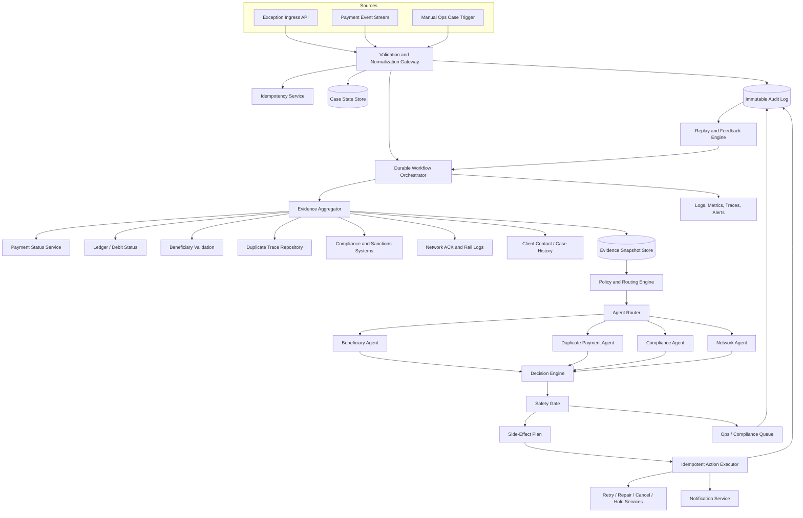

# Payment Exception Resolution Agent Future Production Implementation Plan

This file is the production-level implementation plan for the Payment Exception Resolution Agent. It assumes the MVP has proven the core routing idea, then expands it into a safe, auditable, durable, and fault-tolerant payment exception platform.

The central design choice is to use one canonical event contract at ingress, one durable evidence snapshot, and versioned scoped contracts for each subagent. Agents produce recommendations only. A separate decision engine and safety gate control all side effects.

## 1. Production objective

Build a system that can receive payment exception events, gather evidence, classify root cause, invoke isolated domain subagents, decide the safest operational outcome, and execute approved side effects with idempotency, auditability, replay, and human escalation.

The production system must optimize for safe resolution, not maximum automation.

## 2. Production principles

1. **Fail closed for compliance**: any compliance signal leads to hold or compliance escalation.
2. **No retry under uncertainty**: if funds movement or network finality is unknown, reconcile before retry.
3. **No duplicate side effects**: all ingestion, decisions, and actions require idempotency keys.
4. **Agents are read-only**: subagents cannot execute retry, cancel, repair, release, notify, or update cases directly.
5. **Decision engine owns final action**: agent recommendations are inputs, not authority.
6. **Safety gate owns side-effect eligibility**: hard rules override all recommendations.
7. **Every decision is replayable**: store input, evidence snapshot, policy version, agent version, decision, and side-effect result.
8. **Human review is a valid success outcome**: safe escalation is better than unsafe automation.

## 3. Production architecture



## 4. Production component responsibilities

| Component | Responsibility |
|---|---|
| Exception Ingress API | Accept synchronous exception requests and return case status or decision |
| Event Stream Consumer | Consume asynchronous payment failure, update, acknowledgement, and retry events |
| Validation and Normalization Gateway | Enforce schema, normalize rail-specific payloads, attach trace IDs, mask sensitive fields |
| Idempotency Service | Prevent duplicate case creation, duplicate decisions, and duplicate side effects |
| Case State Store | Durable lifecycle record for each exception case |
| Evidence Aggregator | Query payment, ledger, network, beneficiary, duplicate, compliance, and history systems |
| Evidence Snapshot Store | Store immutable evidence snapshots with freshness, source status, hashes, and conflicts |
| Policy and Routing Engine | Apply routing rules, thresholds, feature flags, kill switches, and regulatory constraints |
| Agent Router | Invoke exactly the allowed subagents using scoped versioned input contracts |
| Specialized Subagents | Analyze domain context and return structured recommendations |
| Decision Engine | Merge agent outputs and policy into a final recommendation |
| Safety Gate | Enforce hard safety rules before any side-effect plan is approved |
| Idempotent Action Executor | Execute approved retry, repair, cancel, hold, case creation, or notification actions |
| Audit Log | Append-only record of inputs, evidence, checkpoints, decisions, actions, and operator overrides |
| Replay Engine | Reopen or reprocess cases when new evidence, acknowledgements, or human feedback arrives |
| Observability Stack | Track health, latency, failures, decision quality, and operational impact |

## 5. Production canonical ingress schema

This is the best target shape for real production events. It is intentionally richer than the MVP because production needs replay, audit, idempotency, privacy, and safe side-effect control.

```json
{
  "schema_version": "payment-exception-event-1.0",
  "event": {
    "event_id": "evt-001",
    "event_version": 1,
    "event_type": "PAYMENT_EXCEPTION_CREATED",
    "event_timestamp": "2026-06-09T06:00:01Z",
    "source_system": "payment-orchestrator",
    "correlation_id": "corr-abc",
    "causation_id": "payment-submit-xyz",
    "idempotency_key": "payment-orchestrator:evt-001:1"
  },
  "payment": {
    "payment_id": "pay-001",
    "payment_version": 3,
    "client_id": "client-123",
    "client_segment": "COMMERCIAL",
    "client_reference": "INV-7788",
    "account_id_token": "acct_tok_456",
    "payment_rail": "UPI",
    "payment_type": "OUTBOUND_TRANSFER",
    "amount": "12500.50",
    "currency": "INR",
    "submitted_timestamp": "2026-06-09T06:00:00Z",
    "current_transaction_status": "FAILED",
    "status_last_updated_at": "2026-06-09T06:00:01Z"
  },
  "parties": {
    "originator": {
      "client_id": "client-123",
      "account_id_token": "acct_tok_456",
      "country": "IN"
    },
    "beneficiary": {
      "beneficiary_id": "bene-789",
      "name": "Asha Rao",
      "account_number_token": "acct_tok_bene_7890",
      "account_number_masked": "XXXXXX7890",
      "ifsc": "HDFC0001234",
      "upi_id_token": "upi_tok_123",
      "upi_id_masked": "a***@upi",
      "country": "IN",
      "beneficiary_fingerprint": "benehash-abc123"
    }
  },
  "exception": {
    "exception_id": "ex-001",
    "exception_code": "INVALID_BENEFICIARY",
    "exception_category_hint": "BENEFICIARY",
    "description": "Beneficiary validation failed",
    "severity": "MEDIUM",
    "detected_at": "2026-06-09T06:00:01Z"
  },
  "evidence_references": {
    "payment_status_ref": "status-ref-001",
    "ledger_ref": "ledger-ref-001",
    "beneficiary_validation_ref": "bene-val-ref-001",
    "duplicate_trace_ref": "dup-ref-001",
    "compliance_screening_ref": "screen-ref-001",
    "network_ack_ref": "network-ref-001",
    "client_contact_ref": "contact-ref-001"
  },
  "controls": {
    "automation_mode": "SHADOW",
    "policy_version": "payments-policy-2026-06-01",
    "rail_kill_switch_active": false,
    "manual_review_threshold": 0.75,
    "safe_retry_threshold": 0.97,
    "duplicate_cancel_threshold": 0.95,
    "beneficiary_repair_threshold": 0.98,
    "high_value_threshold": "100000.00"
  },
  "data_classification": {
    "contains_pii": true,
    "contains_compliance_sensitive_data": false,
    "redaction_profile": "ops-safe-v1"
  }
}
```

## 6. Evidence snapshot schema

The orchestrator should never ask agents to fetch arbitrary data directly. The evidence aggregator gathers data, normalizes it, marks freshness and conflicts, then writes an immutable snapshot.

```json
{
  "schema_version": "evidence-snapshot-1.0",
  "evidence_snapshot_id": "snap-001",
  "case_id": "case-pay-001",
  "payment_id": "pay-001",
  "created_at": "2026-06-09T06:00:05Z",
  "freshness_status": "FRESH",
  "source_results": [
    {
      "source_name": "payment_status",
      "status": "AVAILABLE",
      "observed_at": "2026-06-09T06:00:04Z",
      "latency_ms": 120,
      "staleness_ms": 1000,
      "data_hash": "sha256:payment-status-hash"
    },
    {
      "source_name": "network_acknowledgements",
      "status": "PARTIAL",
      "observed_at": "2026-06-09T05:59:55Z",
      "latency_ms": 850,
      "staleness_ms": 10000,
      "data_hash": "sha256:network-hash"
    }
  ],
  "facts": {
    "funds_movement_status": "NO_FUNDS_MOVED",
    "ledger_debit_status": "NOT_DEBITED",
    "network_finality": "FINAL_FAILED",
    "beneficiary_validation_status": "FAILED",
    "duplicate_candidate_count": 0,
    "compliance_hold_status": "NONE"
  },
  "conflicts": [],
  "missing_sources": [],
  "redaction_profile": "agent-safe-v1"
}
```

Evidence status values:

| Value | Meaning |
|---|---|
| `AVAILABLE` | Source responded and data is fresh enough |
| `PARTIAL` | Source responded but data is incomplete |
| `STALE` | Source data is older than allowed freshness budget |
| `UNAVAILABLE` | Source timed out or returned an error |
| `CONFLICTING` | Source contradicts another source |

## 7. Shared production subagent invocation envelope

Each subagent input uses the same envelope and a scoped `context`.

```json
{
  "schema_version": "agent-invocation-1.0",
  "invocation_id": "inv-001",
  "workflow_id": "wf-case-pay-001",
  "trace_id": "trace-evt-001",
  "case_id": "case-pay-001",
  "event_id": "evt-001",
  "payment_id": "pay-001",
  "evidence_snapshot_id": "snap-001",
  "policy_version": "payments-policy-2026-06-01",
  "agent_name": "BeneficiaryAgent",
  "agent_version": "1.0.0",
  "created_at": "2026-06-09T06:00:06Z",
  "deadline_at": "2026-06-09T06:00:09Z",
  "permissions": {
    "can_read_external_systems": false,
    "can_execute_side_effects": false,
    "allowed_data_classes": ["OPS_SAFE", "PAYMENT_SUMMARY"]
  },
  "policy": {
    "automation_mode": "SHADOW",
    "manual_review_threshold": 0.75
  },
  "context": {}
}
```

Envelope requirements:

- The subagent receives a snapshot, not open-ended access to raw systems.
- The subagent cannot execute side effects.
- The subagent must finish before `deadline_at`.
- The orchestrator validates output against a strict response schema.
- The invocation is replayable using `evidence_snapshot_id`, `policy_version`, and `agent_version`.

## 8. Production subagent input schemas

### 8.1 Beneficiary Agent production schema

Purpose: determine whether beneficiary details caused the exception and whether correction, repair recommendation, client outreach, or manual review is safest.

```json
{
  "schema_version": "agent-invocation-1.0",
  "invocation_id": "inv-beneficiary-001",
  "workflow_id": "wf-case-pay-001",
  "trace_id": "trace-evt-001",
  "case_id": "case-pay-001",
  "event_id": "evt-001",
  "payment_id": "pay-001",
  "evidence_snapshot_id": "snap-001",
  "policy_version": "payments-policy-2026-06-01",
  "agent_name": "BeneficiaryAgent",
  "agent_version": "1.0.0",
  "created_at": "2026-06-09T06:00:06Z",
  "deadline_at": "2026-06-09T06:00:09Z",
  "permissions": {
    "can_read_external_systems": false,
    "can_execute_side_effects": false,
    "allowed_data_classes": ["OPS_SAFE", "PAYMENT_SUMMARY", "BENEFICIARY_MASKED"]
  },
  "policy": {
    "automation_mode": "SHADOW",
    "manual_review_threshold": 0.75,
    "beneficiary_repair_threshold": 0.98,
    "max_auto_repair_amount": "25000.00",
    "repair_requires_client_confirmation": true
  },
  "context": {
    "payment_summary": {
      "client_id": "client-123",
      "client_segment": "COMMERCIAL",
      "payment_rail": "UPI",
      "payment_type": "OUTBOUND_TRANSFER",
      "amount": "12500.50",
      "currency": "INR",
      "submitted_timestamp": "2026-06-09T06:00:00Z",
      "current_transaction_status": "FAILED",
      "funds_movement_status": "NO_FUNDS_MOVED",
      "ledger_debit_status": "NOT_DEBITED",
      "network_finality": "FINAL_FAILED"
    },
    "exception": {
      "exception_code": "INVALID_BENEFICIARY",
      "description": "Beneficiary validation failed",
      "severity": "MEDIUM"
    },
    "beneficiary": {
      "beneficiary_id": "bene-789",
      "name": "Asha Rao",
      "account_number_token": "acct_tok_bene_7890",
      "account_number_masked": "XXXXXX7890",
      "ifsc": "HDFC0001234",
      "upi_id_token": "upi_tok_123",
      "upi_id_masked": "a***@upi",
      "country": "IN",
      "beneficiary_fingerprint": "benehash-abc123"
    },
    "validation_evidence": {
      "validation_status": "FAILED",
      "failed_fields": ["ifsc"],
      "directory_check_status": "INVALID_ROUTING_CODE",
      "name_match_status": "NOT_EVALUATED",
      "suggested_correction": null,
      "suggested_correction_confidence": 0.0,
      "validation_confidence": 0.91,
      "source_freshness": "FRESH"
    },
    "client_history_summary": {
      "open_contact_case_count": 0,
      "last_contacted_at": null,
      "last_contact_outcome": null
    }
  }
}
```

Allowed recommendations:

- `REQUEST_CLIENT_CORRECTION`
- `RECOMMEND_REPAIR`
- `MANUAL_REVIEW`
- `HOLD_AND_RECONCILE`

Hard constraints:

- No repair recommendation when funds movement is unknown.
- No repair recommendation when compliance hold exists.
- No auto-change of beneficiary data without client confirmation or explicit policy.
- No retry recommendation from this agent.

### 8.2 Duplicate Payment Agent production schema

Purpose: identify whether the payment is a duplicate submission and prevent duplicate debit or duplicate beneficiary credit.

```json
{
  "schema_version": "agent-invocation-1.0",
  "invocation_id": "inv-duplicate-001",
  "workflow_id": "wf-case-pay-002",
  "trace_id": "trace-evt-002",
  "case_id": "case-pay-002",
  "event_id": "evt-002",
  "payment_id": "pay-002",
  "evidence_snapshot_id": "snap-002",
  "policy_version": "payments-policy-2026-06-01",
  "agent_name": "DuplicatePaymentAgent",
  "agent_version": "1.0.0",
  "created_at": "2026-06-09T06:01:06Z",
  "deadline_at": "2026-06-09T06:01:09Z",
  "permissions": {
    "can_read_external_systems": false,
    "can_execute_side_effects": false,
    "allowed_data_classes": ["OPS_SAFE", "PAYMENT_SUMMARY", "DUPLICATE_TRACE"]
  },
  "policy": {
    "automation_mode": "SHADOW",
    "manual_review_threshold": 0.75,
    "duplicate_cancel_threshold": 0.95,
    "duplicate_time_window_minutes": 30,
    "high_value_threshold": "100000.00"
  },
  "context": {
    "payment_summary": {
      "client_id": "client-123",
      "client_reference": "INV-7788",
      "payment_rail": "UPI",
      "amount": "12500.50",
      "currency": "INR",
      "submitted_timestamp": "2026-06-09T06:01:00Z",
      "current_transaction_status": "PENDING",
      "funds_movement_status": "UNKNOWN",
      "ledger_debit_status": "UNKNOWN",
      "network_finality": "NOT_FINAL"
    },
    "payment_fingerprint": {
      "fingerprint_id": "fp-001",
      "fingerprint_hash": "client-123:12500.50:INR:benehash-abc123:INV-7788",
      "components": ["client_id", "amount", "currency", "beneficiary_fingerprint", "client_reference"]
    },
    "beneficiary_summary": {
      "beneficiary_id": "bene-789",
      "beneficiary_fingerprint": "benehash-abc123",
      "country": "IN"
    },
    "duplicate_candidates": [
      {
        "payment_id": "pay-001",
        "submitted_timestamp": "2026-06-09T06:00:00Z",
        "current_transaction_status": "COMPLETED",
        "funds_movement_status": "FUNDS_MOVED",
        "ledger_debit_status": "DEBITED",
        "network_finality": "FINAL_SUCCESS",
        "match_score": 0.98,
        "matched_fields": ["client_id", "amount", "currency", "beneficiary_fingerprint", "client_reference"],
        "is_actionable_original": true
      }
    ],
    "retry_history": {
      "prior_retry_events": [],
      "retry_count": 0
    }
  }
}
```

Allowed recommendations:

- `CANCEL_DUPLICATE`
- `HOLD_AND_RECONCILE`
- `MARK_NOT_DUPLICATE`
- `MANUAL_REVIEW`

Hard constraints:

- Never cancel the original completed payment automatically.
- Never retry a possible duplicate.
- Cancel duplicate only if original is final success and duplicate is not final.
- Multiple high-confidence candidates require manual review.

### 8.3 Compliance / Sanctions Agent production schema

Purpose: identify compliance, sanctions, AML, policy, or jurisdictional constraints and force safe escalation.

```json
{
  "schema_version": "agent-invocation-1.0",
  "invocation_id": "inv-compliance-001",
  "workflow_id": "wf-case-pay-003",
  "trace_id": "trace-evt-003",
  "case_id": "case-pay-003",
  "event_id": "evt-003",
  "payment_id": "pay-003",
  "evidence_snapshot_id": "snap-003",
  "policy_version": "payments-policy-2026-06-01",
  "agent_name": "ComplianceAgent",
  "agent_version": "1.0.0",
  "created_at": "2026-06-09T06:02:06Z",
  "deadline_at": "2026-06-09T06:02:09Z",
  "permissions": {
    "can_read_external_systems": false,
    "can_execute_side_effects": false,
    "allowed_data_classes": ["OPS_SAFE", "COMPLIANCE_SUMMARY"],
    "restricted_data_classes_excluded": ["WATCHLIST_DETAILS", "FULL_SCREENING_PAYLOAD"]
  },
  "policy": {
    "automation_mode": "SHADOW",
    "manual_review_threshold": 0.75,
    "compliance_auto_release_allowed": false,
    "client_disclosure_profile": "NO_SENSITIVE_DISCLOSURE"
  },
  "context": {
    "payment_summary": {
      "client_id": "client-123",
      "client_segment": "COMMERCIAL",
      "payment_rail": "WIRE",
      "amount": "250000.00",
      "currency": "USD",
      "origin_country": "US",
      "destination_country": "AE",
      "current_transaction_status": "HELD"
    },
    "party_summary": {
      "originator_country": "US",
      "beneficiary_id": "bene-999",
      "beneficiary_name": "Global Trading LLC",
      "beneficiary_country": "AE",
      "beneficiary_fingerprint": "benehash-risk-999"
    },
    "exception": {
      "exception_code": "SANCTIONS_REVIEW",
      "description": "Payment requires sanctions screening review",
      "severity": "HIGH"
    },
    "compliance_evidence": {
      "compliance_hold_status": "SANCTIONS_REVIEW",
      "screening_result": "POTENTIAL_MATCH",
      "screening_reference": "screen-555",
      "case_reference": "comp-case-1001",
      "risk_flags": ["POTENTIAL_SANCTIONS_MATCH", "HIGH_VALUE_PAYMENT", "CROSS_BORDER"],
      "source_freshness": "FRESH"
    }
  }
}
```

Allowed recommendations:

- `ESCALATE_COMPLIANCE`
- `HOLD_PAYMENT`
- `AWAIT_COMPLIANCE_DECISION`

Hard constraints:

- No auto-release from this system.
- No retry, repair, or cancel for convenience while compliance state is unresolved.
- No sensitive sanctions details in general operations output.
- Compliance system unavailable means fail closed with hold and escalation.

### 8.4 Network / Payment Rail Failure Agent production schema

Purpose: diagnose network, rail, timeout, downstream, acknowledgement, and finality issues.

```json
{
  "schema_version": "agent-invocation-1.0",
  "invocation_id": "inv-network-001",
  "workflow_id": "wf-case-pay-004",
  "trace_id": "trace-evt-004",
  "case_id": "case-pay-004",
  "event_id": "evt-004",
  "payment_id": "pay-004",
  "evidence_snapshot_id": "snap-004",
  "policy_version": "payments-policy-2026-06-01",
  "agent_name": "NetworkAgent",
  "agent_version": "1.0.0",
  "created_at": "2026-06-09T06:03:06Z",
  "deadline_at": "2026-06-09T06:03:09Z",
  "permissions": {
    "can_read_external_systems": false,
    "can_execute_side_effects": false,
    "allowed_data_classes": ["OPS_SAFE", "PAYMENT_SUMMARY", "NETWORK_TRACE"]
  },
  "policy": {
    "automation_mode": "SHADOW",
    "manual_review_threshold": 0.75,
    "safe_retry_threshold": 0.97,
    "max_retry_attempts": 1,
    "rail_kill_switch_active": false
  },
  "context": {
    "payment_summary": {
      "payment_rail": "UPI",
      "rail_transaction_id": "upi-txn-001",
      "amount": "12500.50",
      "currency": "INR",
      "submitted_timestamp": "2026-06-09T06:03:00Z",
      "current_transaction_status": "UNKNOWN",
      "funds_movement_status": "UNKNOWN",
      "ledger_debit_status": "UNKNOWN",
      "network_finality": "NOT_FINAL"
    },
    "exception": {
      "exception_code": "NETWORK_TIMEOUT",
      "description": "No final acknowledgement received before timeout",
      "severity": "MEDIUM"
    },
    "network_evidence": {
      "rail_health_status": "DEGRADED",
      "rail_incident_id": "incident-upi-123",
      "network_acknowledgements": [
        {
          "ack_id": "ack-1",
          "external_message_id": "msg-001",
          "ack_type": "SUBMITTED",
          "ack_status": "ACCEPTED_BY_GATEWAY",
          "received_at": "2026-06-09T06:03:02Z",
          "is_final": false,
          "raw_message_ref": "network-msg-ref-001"
        }
      ],
      "last_final_acknowledgement": null,
      "source_freshness": "PARTIAL"
    },
    "retry_history": {
      "prior_retry_events": [],
      "retry_count": 0,
      "last_retry_status": null
    },
    "duplicate_risk_summary": {
      "duplicate_candidate_count": 0,
      "max_duplicate_match_score": 0.0
    }
  }
}
```

Allowed recommendations:

- `WAIT_FOR_RECONCILIATION`
- `DEFER_UNTIL_NETWORK_RECOVERY`
- `RECOMMEND_SAFE_RETRY`
- `HOLD_AND_RECONCILE`
- `MANUAL_REVIEW`

Hard constraints:

- No retry when network finality is not final.
- No retry when funds movement is unknown.
- No retry when duplicate risk exists.
- No retry when rail kill switch is active.
- Prior retry with unknown result blocks further retry.

## 9. Common production subagent output schema

```json
{
  "schema_version": "agent-decision-1.0",
  "invocation_id": "inv-beneficiary-001",
  "agent_name": "BeneficiaryAgent",
  "agent_version": "1.0.0",
  "case_id": "case-pay-001",
  "payment_id": "pay-001",
  "evidence_snapshot_id": "snap-001",
  "classification": "incorrect_beneficiary",
  "recommended_action": "REQUEST_CLIENT_CORRECTION",
  "automation_eligible": false,
  "confidence": 0.91,
  "risk_level": "MEDIUM",
  "reason_codes": ["INVALID_IFSC", "NO_FUNDS_MOVED", "CLIENT_INPUT_REQUIRED"],
  "evidence_facts": [
    "validation_evidence.validation_status=FAILED",
    "validation_evidence.failed_fields=[ifsc]",
    "payment_summary.funds_movement_status=NO_FUNDS_MOVED"
  ],
  "policy_considerations": [
    "repair_requires_client_confirmation=true"
  ],
  "unsafe_actions_blocked": ["RETRY_PAYMENT"],
  "explanation": "Beneficiary validation failed and no deterministic correction is available. Client confirmation is required before resubmission.",
  "next_steps": [
    "Create client outreach task",
    "Do not retry until corrected beneficiary details are received"
  ],
  "output_valid_until": "2026-06-09T06:10:06Z"
}
```

Output validation rules:

- `confidence` must be between 0 and 1.
- `recommended_action` must be one of the actions allowed for that agent.
- `automation_eligible` can be true only if the recommended action is eligible under policy.
- Every recommendation must include evidence facts and reason codes.
- Output must not include raw unmasked account numbers, raw UPI IDs, or restricted compliance details.

## 10. Decision engine and safety gate

The decision engine consumes one or more agent recommendations, evidence snapshot, and policy config. The safety gate enforces hard constraints before any side-effect plan is created.

### Hard safety rules

| Rule | Result |
|---|---|
| Compliance hold exists | Force compliance escalation, block all financial actions |
| Compliance data unavailable but compliance risk possible | Hold and escalate |
| Funds movement unknown | Block retry and repair |
| Network finality not final | Block retry |
| Duplicate candidate above threshold | Block retry |
| Duplicate cancellation candidate is final or ambiguous | Block cancellation |
| Evidence conflict exists | Manual review or reconciliation |
| Agent confidence below threshold | Manual review unless action is hold or escalation |
| Agent output invalid | Discard output and route to manual review |
| Audit log unavailable | Stop side effects and fail closed |
| Rail kill switch active | Block rail-specific automation |
| High-value threshold exceeded | Require human approval |

### Automation eligibility thresholds

| Action | Minimum confidence | Additional requirements |
|---|---:|---|
| Create ops case | 0.50 | Valid case and audit log available |
| Client outreach task | 0.70 | No sensitive compliance disclosure |
| Compliance escalation | No minimum | Any compliance signal or missing compliance evidence |
| Hold or defer | 0.60 | Evidence of uncertainty or policy rule |
| Cancel duplicate | 0.95 | Confirmed original success and current duplicate is non-final |
| Safe retry | 0.97 | Final failure, no funds moved, no duplicate risk, no compliance hold |
| Beneficiary repair | 0.98 | Deterministic correction, policy approval, no funds moved, client confirmation as required |
| Compliance release | Not supported | Must remain outside this agentic system unless future policy changes |

## 11. Production exception handling and fallbacks

| Failure mode | Detection | Fallback |
|---|---|---|
| Malformed ingress payload | Schema validation failure | Reject or send to dead-letter queue, no side effects |
| Duplicate event | Existing ingress idempotency key | Return existing case status or decision |
| Out-of-order event | Older event version or timestamp | Store as historical evidence, replay only if policy allows |
| Payment status unavailable | Timeout or circuit breaker | Use cached evidence only for non-side-effect decisions, otherwise hold |
| Ledger unavailable | Timeout or circuit breaker | Block retry, repair, and cancel |
| Network evidence unavailable | Timeout, stale, or partial ACK data | Wait for reconciliation, no retry |
| Beneficiary validation unavailable | Timeout or stale response | Client correction only if existing evidence is enough, otherwise manual review |
| Compliance unavailable | Timeout or stale response | Fail closed with hold and compliance escalation |
| Duplicate repository unavailable | Timeout or stale response | Block retry and route to manual review or reconciliation |
| Agent timeout | Deadline exceeded | Retry once for infrastructure error, then fallback to manual review |
| Agent invalid output | Output schema failure | Discard output, mark agent unhealthy, route to manual review |
| Side-effect executor timeout | Action pending beyond budget | Retry with same idempotency key, then side-effect dead-letter queue |
| Audit log write failure | Append failure | Stop workflow before side effects, alert immediately |
| Policy config missing | Config validation failure | Disable automation for affected route |
| Kill switch active | Runtime control | Recommendation-only mode or manual review |

## 12. Production checkpoints

Durable checkpoints should be stored on every case.

1. `ingress_received`
2. `ingress_schema_validated`
3. `payload_normalized`
4. `idempotency_checked`
5. `case_created_or_resumed`
6. `audit_ingress_written`
7. `evidence_collection_started`
8. `evidence_source_completed:<source>`
9. `evidence_snapshot_created`
10. `policy_loaded`
11. `classification_completed`
12. `agent_invocation_created:<agent>`
13. `agent_input_validated:<agent>`
14. `agent_invocation_completed:<agent>`
15. `agent_output_validated:<agent>`
16. `decision_created`
17. `safety_gate_completed`
18. `side_effect_plan_created`
19. `side_effect_executed:<action>` or `side_effect_queued:<action>`
20. `case_state_updated`
21. `audit_decision_written`
22. `replay_registered_if_needed`

Checkpoint fields:

```json
{
  "checkpoint_id": "chk-001",
  "case_id": "case-pay-001",
  "name": "agent_output_validated:BeneficiaryAgent",
  "status": "PASSED",
  "timestamp": "2026-06-09T06:00:08Z",
  "component": "orchestrator",
  "latency_ms": 42,
  "input_hash": "sha256:input-hash",
  "output_hash": "sha256:output-hash",
  "error_class": null,
  "retry_count": 0
}
```

## 13. Idempotency strategy

| Layer | Key | Purpose |
|---|---|---|
| Ingress | `source_system:event_id:event_version` | Prevent duplicate event processing |
| Case | `payment_id:exception_id:case_epoch` | Prevent duplicate active cases for same exception |
| Evidence snapshot | `case_id:evidence_source_versions` | Avoid duplicate snapshots for identical source versions |
| Agent invocation | `case_id:agent_name:evidence_snapshot_id:agent_version` | Make agent results replayable |
| Decision | `case_id:evidence_snapshot_id:policy_version` | Prevent conflicting decisions on same facts |
| Side effect | `case_id:action_type:target_id:action_version` | Prevent duplicate retry, cancel, hold, or notification |
| Replay | `case_id:replay_reason:new_evidence_id` | Prevent replay loops |

Implementation requirements:

- Use conditional inserts or database transactions for idempotency records.
- Downstream action services must accept caller-provided idempotency keys.
- Retries must reuse the same side-effect idempotency key.
- Never create a new side-effect key just because an HTTP request timed out.

## 14. Subagent isolation requirements

| Isolation area | Requirement |
|---|---|
| Contract | Every agent has a versioned input and output schema |
| Data access | Agents receive only scoped snapshot data, not raw system credentials |
| Side effects | Agents cannot execute side effects directly |
| Runtime | Per-agent timeout, retry budget, and circuit breaker |
| Validation | Orchestrator validates every input and output |
| Versioning | Decisions record agent version and policy version |
| Audit | Every invocation is logged with hashes and timestamps |
| Permission | Compliance-sensitive data is excluded unless the agent is allowed to see it |
| Failure domain | A broken agent cannot break the whole platform |
| Rollback | Agents can be disabled or rolled back independently |

## 15. Observability

### Logs

- Structured JSON logs with `trace_id`, `case_id`, `payment_id`, `event_id`, `agent_name`, `policy_version`, and checkpoint name.
- No raw account numbers, raw UPI IDs, or watchlist details.
- Store evidence references and hashes instead of sensitive raw payloads.

### Metrics

| Metric | Purpose |
|---|---|
| `exceptions_received_total` | Incoming exception volume by rail, client segment, and category |
| `classification_total` | Distribution of orchestrator classifications |
| `agent_invocation_total` | Agent usage by type and version |
| `agent_failure_rate` | Agent health monitoring |
| `agent_latency_ms` | Agent latency SLOs |
| `evidence_source_timeout_rate` | Dependency reliability |
| `manual_review_rate` | Automation effectiveness and safety fallback volume |
| `side_effect_attempt_total` | Financial action monitoring |
| `side_effect_idempotency_reuse_total` | Duplicate side-effect prevention |
| `decision_override_rate` | Human disagreement and policy drift |
| `duplicate_prevented_total` | Business value metric |
| `network_reconciliation_wait_total` | Network uncertainty volume |
| `compliance_escalation_total` | Compliance workload |
| `dead_letter_queue_depth` | Operational backlog |

### Alerts

- Audit log unavailable.
- Compliance system unavailable.
- Sudden spike in safe retry recommendations.
- Duplicate side-effect attempt detected.
- Agent invalid output rate above threshold.
- Manual review queue SLA breach.
- Network rail outage detected.
- Replay loop detected.
- Kill switch activated.

## 16. Security and privacy

- Tokenize account numbers, account IDs, and UPI IDs.
- Mask values in logs and general operations output.
- Use TLS for transport and encryption at rest.
- Apply least privilege per service and per agent.
- Keep restricted compliance details out of general agent contexts.
- Record access logs for sensitive data reads.
- Use a secrets manager for credentials.
- If LLMs are introduced later, redact sensitive data before prompts and validate all model output.
- Separate compliance audit data from standard operations notes.

## 17. Deployment roadmap

### Phase 0: Offline replay

- Replay historical exceptions with no live side effects.
- Compare system decisions with human outcomes.
- Tune schema, policy, and rules.

Exit criteria:

- Structured decision validity above 95 percent.
- No critical unsafe recommendation in reviewed samples.
- Strong reviewer agreement on low-risk recommendations.

### Phase 1: Shadow mode

- Consume live events and produce decisions silently.
- No operator-facing recommendations and no side effects.
- Measure drift, latency, and dependency health.

Exit criteria:

- Stable latency and low invalid output rate.
- Audit replay works for sampled cases.
- Kill switch and fallback routing verified.

### Phase 2: Assisted operations

- Show recommendations to operations and compliance reviewers.
- Humans approve all actions.
- Capture override reasons.

Exit criteria:

- Reduced investigation time.
- Low disagreement on client outreach, compliance escalation, and network hold cases.
- Override reasons are reviewed and incorporated into policy.

### Phase 3: Limited non-financial automation

- Automatically create cases, client outreach tasks, holds, deferrals, and compliance escalations.
- No automatic retry, repair, release, or duplicate cancellation.

Exit criteria:

- No duplicate side effects.
- Complete audit coverage.
- Operations signs off on workflow behavior.

### Phase 4: Guarded financial automation

- Enable narrow retry or duplicate cancellation only for low-risk cohorts.
- Use strict thresholds, low-value limits, rail-specific kill switches, and real-time monitoring.

Exit criteria:

- Zero confirmed duplicate money movement caused by automation.
- False positive cancellation and retry rates inside approved risk appetite.
- Engineering, operations, risk, and compliance sign-off.

## 18. Replay and feedback loop

Replay triggers:

- New network acknowledgement arrives.
- Payment status changes from unknown to final.
- Retry outcome is received.
- Client provides corrected beneficiary details.
- Human reviewer overrides decision.
- Compliance hold changes state.
- Policy version changes and backtesting is requested.

Replay rules:

- Never overwrite prior decisions. Create a new decision version.
- Reuse historical evidence snapshots for audit, then attach new evidence snapshots.
- Do not repeat side effects unless a new side-effect plan is approved with a valid idempotency key.
- Cap automated replays, for example three replays per case before manual review.
- Link every reopened case to the prior decision and replay reason.

## 19. Production testing strategy

| Test type | Coverage |
|---|---|
| Schema tests | Required fields, versioning, redaction, invalid enum values |
| Classifier tests | Priority order, compliance override, duplicate before retry |
| Agent contract tests | Input slicing, output validation, forbidden action rejection |
| Safety gate tests | Hard rules override unsafe recommendations |
| Idempotency tests | Duplicate events, duplicate action requests, timeout retry behavior |
| Dependency failure tests | Unavailable, stale, partial, and conflicting evidence |
| Replay tests | New evidence reopens case without repeating side effects |
| Audit tests | Decision can be reconstructed from event, evidence, policy, and agent versions |
| Security tests | PII masking, compliance data isolation, least-privilege access |
| Load tests | Event volume, agent latency, queue depth, dependency saturation |
| Chaos tests | Agent crash, audit store failure, event redelivery, network outage |

## 20. Production implementation roadmap

| Milestone | Scope | Success criteria |
|---|---|---|
| M1: MVP | Mock API, orchestrator, four agents, fixtures | Five demo cases pass end-to-end |
| M2: Durable core | Case store, idempotency store, audit log | Duplicate events do not duplicate decisions |
| M3: Evidence layer | Real or stubbed adapters with freshness and conflict metadata | Partial evidence fails safely |
| M4: Workflow engine | Durable orchestration, timeouts, retries, replay | Workflow survives restarts and dependency failures |
| M5: Operations integration | Ops queue, compliance queue, client outreach task creation | Humans can review and override decisions |
| M6: Shadow mode | Live events, no side effects | Decision quality validated against human outcomes |
| M7: Limited automation | Case creation, holds, deferrals, compliance escalation | No duplicate side effects and complete auditability |
| M8: Guarded financial automation | Narrow retry, repair, or duplicate cancellation | Approved by risk, compliance, operations, and engineering |

## 21. Recommended technology choices

| Area | Recommendation |
|---|---|
| API | FastAPI, Spring Boot, or Node/NestJS based on team familiarity |
| Workflow | Temporal, Cadence, or cloud-native Step Functions |
| Eventing | Kafka, Pub/Sub, or bank event platform |
| State store | PostgreSQL for case state and idempotency |
| Audit | Append-only log or WORM-compatible storage |
| Cache | Redis for short-lived lookup cache, never as source of truth |
| Observability | OpenTelemetry, Prometheus, Grafana, centralized logs |
| Policy | Versioned config in Git plus runtime feature flags and kill switches |
| Secrets | Vault or cloud secret manager |
| Testing | Contract tests, replay tests, safety gate tests, and chaos tests |

## 22. Final production stance

Production payment exception resolution should be conservative by design. The system should automate investigation first, then safe handoffs, then only the narrowest possible set of financial actions after evidence, policy, idempotency, and audit controls are mature.

A held payment with a clear explanation is better than an unsafe retry, duplicate debit, incorrect beneficiary repair, or accidental compliance release.
