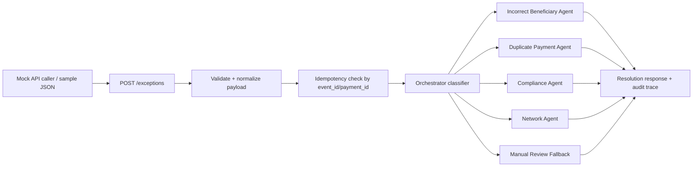
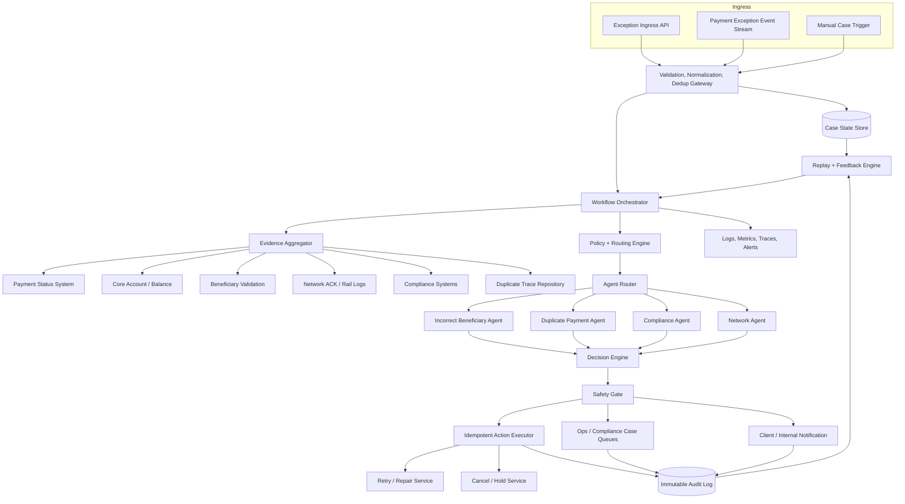

# Payment Exception Resolution Agent Implementation Plans

This document provides two implementation plans for the Payment Exception Resolution Agent described in [`payment_exception_resolution_agent_problem_statement.md`](./payment_exception_resolution_agent_problem_statement.md):

1. **1.5-hour MVP plan**: a focused demo with a mock API, deterministic orchestrator, and four isolated subagents.
2. **Production-level plan**: a realistic architecture for a safe, auditable, fault-tolerant payment exception resolution system.

The MVP should be built to demonstrate the production design, not to fake it. The production plan should guide what gets simplified, mocked, or deferred in the MVP.

---

## 1. Shared Problem Framing

### Goal

Create a system that receives a payment exception JSON payload, classifies the likely exception type, delegates investigation to a specialized subagent, and returns a safe resolution recommendation with a clear audit trail.

### Initial agent scope

The first version will support four subagents:

| Subagent | Exception type handled | Example safe outcome |
|---|---|---|
| Incorrect Beneficiary Agent | Invalid account, UPI, IFSC, routing, or beneficiary mismatch | Ask client to correct details, or recommend repair if validation confidence is high |
| Duplicate Payment Submission Agent | Same payment submitted more than once | Cancel duplicate, hold for review, or mark as non-duplicate |
| Compliance Agent | Sanctions, AML, policy, or screening hold | Escalate to compliance queue, never auto-release |
| Network Agent | Payment rail outage, missing acknowledgement, timeout, uncertain status | Defer retry, reconcile status, or retry only when duplicate risk is low |

### Non-blocking assumptions

- MVP implementation language: Python with FastAPI or a simple CLI-compatible HTTP server.
- MVP has no real integrations. All payment, compliance, duplicate, beneficiary, and network evidence is mocked from local JSON or in-memory fixtures.
- Classification is deterministic rules-first, not LLM-first, because the demo must be reliable within 1.5 hours.
- The system produces recommendations and mocked actions. It does not move money.
- Production automation must be conservative. When evidence is missing, stale, conflicting, or high-risk, the system escalates or holds instead of retrying or repairing.

---

## 2. MVP Plan: 1.5-Hour Build

### MVP objective

Build a runnable prototype that accepts a payment exception JSON payload, routes it through an orchestrator, invokes one of four isolated subagent modules, and returns a structured resolution response with explanation, confidence, checkpoints, and fallback/escalation behavior.

### What the MVP must prove

The MVP should demonstrate:

1. Ingress: receive and validate a payment exception payload.
2. Classification: map the payload to one of four supported exception categories.
3. Orchestration: delegate to exactly one specialized subagent.
4. Isolation: each subagent has its own file, contract, and no shared mutable logic except read-only helpers.
5. Decisioning: each subagent returns a safe action, confidence, evidence, and explanation.
6. Fallbacks: malformed, ambiguous, unsupported, or low-confidence cases go to manual review.
7. Auditability: every response includes a trace ID, checkpoints, agent invoked, evidence used, and action rationale.
8. Demo readiness: include 4 to 6 sample payloads covering all subagents and at least one fallback.

### MVP architecture



### MVP suggested file structure

```text
payment_exception_mvp/
  app.py                         # FastAPI app and endpoint wiring
  models.py                      # Request/response schemas
  orchestrator.py                # Classification, routing, checkpoint assembly
  agents/
    __init__.py
    beneficiary_agent.py
    duplicate_agent.py
    compliance_agent.py
    network_agent.py
  fixtures/
    incorrect_beneficiary.json
    duplicate_payment.json
    compliance_hold.json
    network_failure.json
    ambiguous_low_confidence.json
  demo.py                        # Optional: send all fixtures to the API or run CLI demo
  README.md                      # How to run the prototype
```

If FastAPI setup time is too high, implement the same contracts as a CLI script first, then wrap with HTTP only if time remains.

### MVP payload schema

Minimum request shape:

```json
{
  "event_id": "evt-001",
  "payment_id": "pay-123",
  "client_id": "client-987",
  "account_id": "acct-456",
  "payment_rail": "UPI",
  "payment_type": "outbound_transfer",
  "amount": 12500.50,
  "currency": "INR",
  "beneficiary_details": {
    "name": "Asha Rao",
    "account_number": "1234567890",
    "ifsc": "HDFC0001234",
    "upi_id": "asha@upi"
  },
  "submitted_timestamp": "2026-06-09T06:00:00Z",
  "exception_event_type": "PAYMENT_FAILED",
  "exception_code": "INVALID_BENEFICIARY",
  "current_transaction_status": "FAILED",
  "prior_retry_events": [],
  "compliance_hold_status": "NONE",
  "network_acknowledgements": [],
  "client_contact_history": []
}
```

### MVP response schema

```json
{
  "trace_id": "trace-evt-001",
  "payment_id": "pay-123",
  "classification": "incorrect_beneficiary",
  "agent": "IncorrectBeneficiaryAgent",
  "decision": {
    "action": "REQUEST_CLIENT_CORRECTION",
    "automation_allowed": false,
    "confidence": 0.88,
    "priority": "MEDIUM",
    "queue": "client_outreach"
  },
  "evidence": [
    "exception_code=INVALID_BENEFICIARY",
    "beneficiary.ifsc present but validation failed",
    "no successful debit acknowledgement found"
  ],
  "checkpoints": [
    {"name": "payload_validated", "status": "passed"},
    {"name": "idempotency_checked", "status": "passed"},
    {"name": "classification_completed", "status": "passed"},
    {"name": "agent_completed", "status": "passed"},
    {"name": "safe_action_selected", "status": "passed"}
  ],
  "fallbacks_triggered": [],
  "explanation": "The failure appears to be caused by invalid beneficiary details. No automated repair is safe without fresh client confirmation.",
  "next_steps": [
    "Open client outreach task",
    "Ask client to confirm beneficiary account/UPI/IFSC",
    "Do not retry until corrected details are received"
  ]
}
```

### MVP agent contracts

Every subagent should implement the same interface:

```python
def handle(context: PaymentExceptionContext) -> AgentDecision:
    """
    Input: normalized payment exception context.
    Output: deterministic decision with action, confidence, evidence,
    explanation, next_steps, and fallbacks_triggered.
    Side effects: none in MVP. Only returns a recommendation.
    """
```

Common decision fields:

| Field | Purpose |
|---|---|
| `action` | Operational recommendation such as `REQUEST_CLIENT_CORRECTION`, `CANCEL_DUPLICATE`, `ESCALATE_COMPLIANCE`, `WAIT_FOR_NETWORK_RECOVERY`, `MANUAL_REVIEW` |
| `automation_allowed` | Whether the system would be allowed to execute the action automatically in production |
| `confidence` | Numeric confidence from 0.0 to 1.0 |
| `priority` | `LOW`, `MEDIUM`, `HIGH`, or `CRITICAL` |
| `queue` | Operations queue for handoff, if any |
| `evidence` | Human-readable facts used in the decision |
| `explanation` | Short business explanation |
| `next_steps` | Concrete follow-up tasks |
| `fallbacks_triggered` | Any degradation or safety fallback applied |

### MVP deterministic classification rules

Use simple rules in priority order:

1. If `compliance_hold_status` is `HELD`, `SANCTIONS_REVIEW`, `AML_REVIEW`, or exception code contains `COMPLIANCE`, route to `ComplianceAgent`.
2. Else if exception code contains `DUPLICATE`, `DUP_SUBMISSION`, or payload has duplicate markers, route to `DuplicatePaymentAgent`.
3. Else if exception code contains `BENEFICIARY`, `INVALID_ACCOUNT`, `INVALID_UPI`, `INVALID_IFSC`, or `NAME_MISMATCH`, route to `IncorrectBeneficiaryAgent`.
4. Else if exception code contains `NETWORK`, `TIMEOUT`, `NO_ACK`, `RAIL_UNAVAILABLE`, or status is `UNKNOWN`, route to `NetworkAgent`.
5. Else route to manual review fallback with `classification=unknown`.

Why this order matters:

- Compliance wins over everything because compliance holds must never be auto-resolved by other agents.
- Duplicate detection wins over repair and retry because duplicate payment risk is financially dangerous.
- Network uncertainty blocks retries until status is reconciled.

### MVP subagent behavior

#### 1. Incorrect Beneficiary Agent

Input indicators:

- `exception_code` includes `INVALID_BENEFICIARY`, `INVALID_ACCOUNT`, `INVALID_UPI`, `INVALID_IFSC`, `NAME_MISMATCH`.
- Beneficiary details are missing, malformed, or validation failed.

MVP decision rules:

- If required beneficiary fields are missing, return `REQUEST_CLIENT_CORRECTION`, automation disabled.
- If invalid IFSC or UPI pattern is obvious, return `REQUEST_CLIENT_CORRECTION`.
- If mock validation says there is a single safe corrected value and amount is below demo threshold, return `RECOMMEND_REPAIR`, automation disabled in MVP but marked as future candidate.
- If any debit/network acknowledgement indicates funds may have moved, return `MANUAL_REVIEW`.

Fallbacks:

- Missing beneficiary data -> client outreach.
- Conflicting evidence -> operations review.
- Low confidence -> manual review.

#### 2. Duplicate Payment Submission Agent

Input indicators:

- `exception_code` includes `DUPLICATE_PAYMENT` or `DUPLICATE_SUBMISSION`.
- Same client, amount, beneficiary, and close timestamp appear in mock duplicate history.

MVP decision rules:

- If an existing successful payment with same fingerprint exists, return `CANCEL_DUPLICATE` for the later payment.
- If duplicate candidates exist but statuses are uncertain, return `HOLD_AND_RECONCILE`.
- If no duplicate candidate exists, return `MANUAL_REVIEW` or `MARK_NOT_DUPLICATE` depending on confidence.

Fallbacks:

- Missing payment fingerprint -> manual review.
- One payment succeeded and another is pending -> hold pending payment, no retry.
- Multiple candidates -> operations review.

#### 3. Compliance Agent

Input indicators:

- `compliance_hold_status` is not `NONE`.
- Exception code contains `SANCTIONS`, `AML`, `COMPLIANCE`, `POLICY_HOLD`.

MVP decision rules:

- Always return `ESCALATE_COMPLIANCE`.
- `automation_allowed` is always `false`.
- If compliance status is missing but exception implies compliance risk, return `ESCALATE_COMPLIANCE` with fallback `missing_compliance_context`.

Fallbacks:

- Compliance service unavailable -> hold payment and escalate.
- Ambiguous compliance state -> hold payment and escalate.
- Never retry, repair, cancel, or release automatically from this agent.

#### 4. Network Agent

Input indicators:

- Exception code includes `NETWORK_TIMEOUT`, `NO_ACK`, `RAIL_UNAVAILABLE`, `DOWNSTREAM_UNAVAILABLE`.
- Transaction status is `UNKNOWN`, `PENDING`, or `IN_FLIGHT` with missing acknowledgement.

MVP decision rules:

- If network status is unknown, return `WAIT_FOR_RECONCILIATION`, no retry.
- If network outage is active, return `DEFER_UNTIL_NETWORK_RECOVERY`.
- If mock acknowledgement says payment definitely failed and no prior retry exists, return `RECOMMEND_SAFE_RETRY`, automation disabled in MVP.
- If prior retries exist with unknown outcome, return `HOLD_AND_RECONCILE`.

Fallbacks:

- Missing acknowledgements -> hold and reconcile.
- Prior retry uncertainty -> no further retry.
- Network fixture unavailable -> manual review.

### MVP exception handling

The MVP should handle these cases explicitly:

| Exception case | MVP behavior |
|---|---|
| Malformed JSON | HTTP 400 with validation errors and no agent invocation |
| Missing required fields | HTTP 422 or structured `MANUAL_REVIEW` response if partially valid |
| Unsupported exception type | Route to fallback decision `MANUAL_REVIEW` |
| Agent raises an exception | Catch in orchestrator, return `MANUAL_REVIEW`, checkpoint `agent_failed` |
| Agent returns invalid decision | Reject agent output, return `MANUAL_REVIEW`, checkpoint `agent_output_invalid` |
| Duplicate `event_id` | Return cached previous response if present |
| Duplicate `payment_id` with new event | Process as replay, include previous trace reference if using in-memory store |
| Low confidence below 0.75 | Manual review fallback |
| Compliance indicator present | Force compliance route regardless of other signals |

### MVP checkpoints

Every request should produce these checkpoints:

1. `request_received`
2. `payload_validated`
3. `payload_normalized`
4. `idempotency_checked`
5. `classification_completed`
6. `agent_selected`
7. `agent_started`
8. `agent_completed` or `agent_failed`
9. `decision_validated`
10. `safe_action_selected`
11. `response_emitted`

Each checkpoint should include:

```json
{
  "name": "classification_completed",
  "status": "passed",
  "timestamp": "2026-06-09T06:10:00Z",
  "details": "classified as duplicate_payment using exception_code=DUPLICATE_PAYMENT"
}
```

### MVP fallback policy

The demo must repeatedly reinforce the production safety stance:

```text
If uncertain, hold or escalate.
If compliance-related, escalate.
If duplicate risk exists, do not retry.
If network outcome is unknown, reconcile before retry.
If beneficiary details are wrong, ask for correction before resubmission.
```

### MVP implementation timeline: 90 minutes

| Time | Work | Output | Verification |
|---:|---|---|---|
| 0-10 min | Create folder structure and schemas | `models.py`, base response schema | One fixture validates successfully |
| 10-25 min | Implement API/CLI ingress and orchestrator skeleton | `/exceptions` or `demo.py` route | Fixture reaches orchestrator |
| 25-40 min | Implement deterministic classifier and checkpoint builder | `orchestrator.py` | Four fixture types classify correctly |
| 40-65 min | Implement four subagents | Four isolated agent files | Each fixture returns expected action |
| 65-75 min | Add exception handling and fallback policy | Manual review path | Bad/unknown fixture returns safe fallback |
| 75-85 min | Add fixtures and demo script/README | Repeatable demo command | Demo runs all payloads |
| 85-90 min | Final polish | Clean output and talking points | Run smoke test end-to-end |

### MVP smoke tests

Minimum tests to run manually or via `demo.py`:

1. Incorrect beneficiary payload -> `REQUEST_CLIENT_CORRECTION`.
2. Duplicate payment payload -> `CANCEL_DUPLICATE` or `HOLD_AND_RECONCILE`.
3. Compliance hold payload -> `ESCALATE_COMPLIANCE`, automation disabled.
4. Network failure payload -> `WAIT_FOR_RECONCILIATION` or `DEFER_UNTIL_NETWORK_RECOVERY`.
5. Unknown exception payload -> `MANUAL_REVIEW` fallback.
6. Duplicate `event_id` submitted twice -> same response returned or marked idempotent.

### MVP demo narrative

Use this script during presentation:

1. Submit an exception JSON to the mock API.
2. Show orchestrator validation, idempotency, and classification.
3. Show that only the relevant subagent is invoked.
4. Show evidence and checkpoints in the response.
5. Show conservative fallback for low-confidence or unknown cases.
6. Explain how this MVP maps to the production design: replace fixtures with real systems, replace in-memory store with durable state, add queues, observability, RBAC, and rollout controls.

### MVP trade-offs

| Decision | Why acceptable for 1.5h | Production replacement |
|---|---|---|
| Rule-based classifier | Deterministic, fast, demo-safe | Config-driven rules plus model-assisted classification under guardrails |
| In-memory idempotency | Easy to demo duplicate event behavior | Durable idempotency store with transactional writes |
| Mock fixtures | No integration overhead | Payment status, compliance, network, and case-management services |
| Single synchronous request path | Simple demo | Async workflow engine and queues |
| No real side effects | Safe and fast | Controlled side-effect executor with approvals, idempotency keys, and audit log |
| No UI | Focus on architecture | Ops dashboard and case queue integration |

---

## 3. Production-Level Plan

### Production objective

Build a reliable, auditable, configurable agentic system that receives payment exceptions, gathers evidence from internal and external systems, classifies root cause, selects safe remediation, executes approved side effects idempotently, and reopens or replays cases when later evidence changes the decision.

### Production architecture



### Production component responsibilities

| Component | Responsibility |
|---|---|
| Exception Ingress API | Accept synchronous exception requests from systems or manual users |
| Event Stream Consumer | Consume failed payment events from Kafka/PubSub/event bus |
| Validation and Normalization Gateway | Enforce schema, normalize rail-specific fields, reject malformed payloads, attach trace IDs |
| Dedup Gateway | Enforce idempotency using `event_id`, `payment_id`, exception version, and side-effect keys |
| Case State Store | Durable source of truth for exception lifecycle, current state, and replay metadata |
| Workflow Orchestrator | Own workflow state, budgets, branching, retries, timeouts, and termination |
| Evidence Aggregator | Query dependent systems, cache evidence snapshots, label stale or partial evidence |
| Policy and Routing Engine | Apply configurable rules, thresholds, rail controls, and automation eligibility |
| Agent Router | Select allowed subagents and isolate each invocation |
| Specialized Subagents | Produce domain-specific investigation findings and recommended resolution |
| Decision Engine | Merge evidence, resolve conflicts, produce deterministic final recommendation |
| Safety Gate | Enforce hard constraints before any automated side effect |
| Idempotent Action Executor | Execute retry, repair, cancel, hold, case creation, or notification actions exactly once |
| Audit Log | Append-only record of input, evidence, agents, decisions, side effects, and operator overrides |
| Replay and Feedback Engine | Re-evaluate cases when new status events, retry outcomes, or human overrides arrive |
| Observability Stack | Logs, traces, metrics, dashboards, alerts, and dead-letter queue visibility |

### Production data model

#### Payment exception event

```json
{
  "event_id": "evt-001",
  "event_version": 1,
  "idempotency_key": "evt-001:pay-123:1",
  "source_system": "payment-orchestrator",
  "received_at": "2026-06-09T06:00:02Z",
  "payment": {
    "payment_id": "pay-123",
    "client_id": "client-987",
    "account_id": "acct-456",
    "rail": "UPI",
    "type": "outbound_transfer",
    "amount": "12500.50",
    "currency": "INR",
    "submitted_at": "2026-06-09T06:00:00Z"
  },
  "beneficiary": {
    "name": "Asha Rao",
    "account_number_token": "tok_acct_abc",
    "ifsc": "HDFC0001234",
    "upi_id": "asha@upi"
  },
  "exception": {
    "event_type": "PAYMENT_FAILED",
    "code": "INVALID_BENEFICIARY",
    "current_status": "FAILED",
    "description": "Beneficiary validation failed"
  },
  "context_refs": {
    "prior_retry_event_ids": [],
    "network_ack_ids": [],
    "client_contact_ids": []
  }
}
```

Sensitive values should be tokenized or masked wherever possible. Full payment details should be fetched only by services with appropriate authorization.

#### Evidence snapshot

```json
{
  "snapshot_id": "snap-001",
  "payment_id": "pay-123",
  "created_at": "2026-06-09T06:00:05Z",
  "freshness": "fresh",
  "sources": [
    {
      "name": "payment_status",
      "status": "available",
      "latency_ms": 120,
      "observed_at": "2026-06-09T06:00:05Z",
      "data_hash": "sha256:..."
    },
    {
      "name": "network_acknowledgements",
      "status": "partial",
      "latency_ms": 850,
      "observed_at": "2026-06-09T05:59:30Z",
      "staleness_ms": 35000
    }
  ],
  "facts": [
    "payment.current_status=FAILED",
    "beneficiary_validation.result=invalid_ifsc",
    "network_ack.final_debit=false"
  ],
  "conflicts": []
}
```

#### Resolution decision

```json
{
  "decision_id": "dec-001",
  "case_id": "case-pay-123",
  "classification": "incorrect_beneficiary",
  "selected_agent": "IncorrectBeneficiaryAgent",
  "action": "REQUEST_CLIENT_CORRECTION",
  "automation_allowed": false,
  "confidence": 0.91,
  "risk_level": "medium",
  "reason_codes": ["INVALID_BENEFICIARY", "NO_FUNDS_MOVED", "CLIENT_INPUT_REQUIRED"],
  "evidence_snapshot_id": "snap-001",
  "policy_version": "payments-policy-2026-06-01",
  "agent_versions": {
    "IncorrectBeneficiaryAgent": "1.3.2"
  },
  "side_effect_plan": [
    {
      "type": "CREATE_CLIENT_OUTREACH_TASK",
      "idempotency_key": "case-pay-123:client-outreach:v1"
    }
  ],
  "explanation": "The payment failed because beneficiary validation rejected the IFSC. No debit or network success acknowledgement exists. The safe next step is client correction before resubmission."
}
```

### Production workflow

```mermaid
sequenceDiagram
    participant Source as Payment System/Event Bus
    participant Gateway as Ingress Gateway
    participant Orch as Workflow Orchestrator
    participant Evidence as Evidence Aggregator
    participant Agent as Specialized Agent
    participant Decision as Decision Engine
    participant Safety as Safety Gate
    participant Exec as Action Executor
    participant Audit as Audit Log

    Source->>Gateway: Exception event
    Gateway->>Gateway: Validate schema, normalize, deduplicate
    Gateway->>Audit: Record ingress event
    Gateway->>Orch: Start/resume case workflow
    Orch->>Evidence: Gather bounded evidence snapshot
    Evidence-->>Orch: Facts, freshness, conflicts, dependency statuses
    Orch->>Agent: Invoke isolated subagent with evidence snapshot
    Agent-->>Orch: Recommendation + confidence + explanation
    Orch->>Decision: Merge recommendation with policy
    Decision-->>Safety: Final decision + side-effect plan
    Safety->>Safety: Enforce hard safety constraints
    Safety->>Exec: Execute approved idempotent actions
    Exec-->>Audit: Persist side-effect result
    Safety-->>Orch: Completion or escalation
    Orch->>Audit: Persist final case state
```



### Production orchestration model

Use a durable workflow engine such as Temporal, Cadence, AWS Step Functions, or a queue-backed state machine.

The orchestrator owns:

- Case lifecycle: `NEW`, `INVESTIGATING`, `WAITING_FOR_EVIDENCE`, `DECIDED`, `ACTION_PENDING`, `ESCALATED`, `RESOLVED`, `REOPENED`, `FAILED_SAFE`.
- Time budgets for synchronous and asynchronous steps.
- Agent invocation permissions and timeouts.
- Dependency retry policy.
- Decision termination rules.
- Replay behavior when later evidence arrives.
- Idempotency boundaries for all downstream side effects.

Recommended budgets:

| Workflow phase | Primary budget | Fallback if exceeded |
|---|---:|---|
| Ingress validation | 100 ms | Reject malformed input or accept to DLQ |
| Dedup/case lookup | 200 ms | Retry briefly, then enqueue for async processing |
| Evidence aggregation | 2-5 sec | Use partial evidence if safe, otherwise hold/escalate |
| Agent investigation | 1-3 sec per agent | Agent timeout -> fallback decision |
| Decision and safety gate | 500 ms | Fail closed to manual review |
| Side-effect submission | 1-3 sec | Queue action with idempotency key and retry asynchronously |
| End-to-end synchronous API | 5-8 sec | Return `ACCEPTED_FOR_ASYNC_REVIEW` |

### Production subagent isolation

Each subagent must be isolated by contract, permissions, runtime, and failure domain.

| Isolation dimension | Requirement |
|---|---|
| Code boundary | Each subagent packaged as a separate module or service with a versioned interface |
| Input boundary | Agent receives only normalized context and approved evidence snapshot |
| Output boundary | Agent returns structured recommendations, never arbitrary side effects |
| Side effects | Agents cannot directly retry, cancel, release, notify, or update cases |
| Permissions | Read-only permissions scoped to domain evidence needed by that agent |
| Timeouts | Per-agent timeout enforced by orchestrator |
| Retries | Bounded retries only for transient agent infrastructure failures, not for changing recommendations |
| Validation | Agent output schema must be validated before decision engine uses it |
| Circuit breaker | Repeated failures disable that agent and route affected cases to fallback queue |
| Versioning | Decision records include agent version and policy version for replayability |

### Production agent catalogue

#### Incorrect Beneficiary Agent

| Attribute | Detail |
|---|---|
| Purpose | Diagnose beneficiary-related failures and determine whether correction, outreach, or review is safe |
| Inputs | Payment context, beneficiary details, validation results, routing directory evidence, network/debit evidence |
| Outputs | `REQUEST_CLIENT_CORRECTION`, `RECOMMEND_REPAIR`, `MANUAL_REVIEW`, `HOLD` |
| Authority | Recommend repair or outreach only |
| Forbidden actions | Cannot auto-change beneficiary details without safety gate and approval rules; cannot retry directly |
| Dependencies | Beneficiary validation service, routing directory, payment status, network acknowledgements |
| Escalates when | Beneficiary data is missing, validation evidence conflicts, funds may have moved, confidence below threshold |

Production rules:

- Auto-repair is allowed only when the correction is deterministic, low-value threshold is met, client mandate permits repair, and no funds-moved signal exists.
- Client outreach is required for missing or materially changed beneficiary identifiers.
- Name mismatch above configured risk threshold requires manual review.

#### Duplicate Payment Submission Agent

| Attribute | Detail |
|---|---|
| Purpose | Detect duplicate payment submissions and prevent double debit or duplicate beneficiary credit |
| Inputs | Payment fingerprint, client ID, amount, currency, beneficiary hash, timestamps, prior payment statuses, trace repository |
| Outputs | `CANCEL_DUPLICATE`, `HOLD_AND_RECONCILE`, `MARK_NOT_DUPLICATE`, `MANUAL_REVIEW` |
| Authority | Recommend cancellation or hold of duplicate candidates |
| Forbidden actions | Cannot cancel original successful payment without operations approval; cannot retry uncertain duplicates |
| Dependencies | Duplicate trace repository, transaction status, ledger/debit status, network acknowledgements |
| Escalates when | Multiple possible originals, conflicting statuses, uncertain debit result, high-value payment, stale evidence |

Production rules:

- Duplicate fingerprint should include client, amount, currency, beneficiary token/hash, payment rail, timestamp window, and client-provided reference.
- Later duplicate can be cancelled only if the original payment is confirmed accepted or completed and the duplicate is not final.
- If both payments are uncertain, hold both where possible and reconcile.

#### Compliance Agent

| Attribute | Detail |
|---|---|
| Purpose | Handle sanctions, AML, policy, and compliance holds |
| Inputs | Compliance hold status, screening result references, policy flags, payment context, case references |
| Outputs | `ESCALATE_COMPLIANCE`, `HOLD_PAYMENT`, `AWAIT_COMPLIANCE_DECISION` |
| Authority | Recommend hold/escalation only |
| Forbidden actions | Cannot release, retry, repair, cancel for convenience, or notify client with sensitive compliance details unless approved template exists |
| Dependencies | Compliance screening systems, case-management system, policy configuration |
| Escalates when | Always escalates for active holds or ambiguous compliance risk |

Production rules:

- Compliance decisions are non-automatable unless explicitly approved by compliance policy and legal controls.
- The agent should expose evidence references, not sensitive watchlist details, to general operations queues.
- If compliance systems are unavailable, fail closed: hold payment and escalate.

#### Network Agent

| Attribute | Detail |
|---|---|
| Purpose | Resolve payment rail, timeout, acknowledgement, and downstream uncertainty cases |
| Inputs | Network acknowledgement logs, payment status, retry history, rail outage status, ledger evidence |
| Outputs | `WAIT_FOR_RECONCILIATION`, `DEFER_UNTIL_NETWORK_RECOVERY`, `RECOMMEND_SAFE_RETRY`, `HOLD_AND_RECONCILE`, `MANUAL_REVIEW` |
| Authority | Recommend retry only when duplicate and funds-moved risk is acceptably low |
| Forbidden actions | Cannot retry when final status is unknown; cannot ignore prior retries |
| Dependencies | Network message logs, payment status, rail monitoring, ledger/debit system |
| Escalates when | Acknowledgements conflict, rail outage persists, prior retry outcome is uncertain, status source is stale |

Production rules:

- Unknown status means no retry until reconciliation confirms no successful execution.
- Retry limits are rail-specific and policy-driven.
- Network-wide incidents should activate a kill switch that pauses automated retries.

### Production decision policy

#### Hard safety rules

These rules override all agent recommendations:

1. Compliance hold present -> no auto-resolution; escalate compliance.
2. Funds may have moved but status is uncertain -> no retry; reconcile first.
3. Duplicate risk above threshold -> no retry; hold/cancel duplicate only if safe.
4. Evidence conflict across ledger, payment status, and network -> manual review or reconciliation.
5. Missing required evidence for a side effect -> do not execute side effect.
6. Agent output invalid or low confidence -> manual review.
7. Policy or kill switch disables automation for rail/client/amount -> recommendation only, no execution.
8. High-value payments above threshold -> human approval unless explicitly configured otherwise.

#### Confidence thresholds

| Decision type | Minimum confidence | Extra requirement |
|---|---:|---|
| Client outreach | 0.70 | No sensitive compliance disclosure |
| Manual review/escalation | No minimum | Safe default |
| Hold/defer | 0.60 | Evidence of uncertainty or policy rule |
| Cancel duplicate | 0.95 | Confirmed original and non-final duplicate |
| Safe retry | 0.97 | Confirmed no funds moved, no prior uncertain retry, no compliance hold |
| Beneficiary repair | 0.98 | Deterministic correction, low-risk rail, policy approval |
| Compliance release | Not supported by this system | Must remain manual unless future policy changes |

### Production exception handling and fallback design

| Failure mode | Detection | Production fallback |
|---|---|---|
| Malformed ingress payload | Schema validation failure | Reject with 4xx, write audit rejection, do not create side effects |
| Duplicate event delivery | Existing idempotency key | Return existing case/decision, no duplicate side effects |
| Out-of-order events | Event version or timestamp older than current case state | Store as historical evidence, replay only if policy allows |
| Payment status unavailable | Timeout/circuit breaker | Use cached evidence only for non-side-effect decisions; otherwise hold/escalate |
| Ledger/account unavailable | Timeout/circuit breaker | Block retry/cancel/repair; escalate or wait |
| Compliance system unavailable | Timeout/circuit breaker | Fail closed: hold and escalate compliance/ops |
| Network logs unavailable | Timeout/circuit breaker | Wait for reconciliation; no retry |
| Beneficiary validation unavailable | Timeout/circuit breaker | Client outreach only if existing evidence is enough; otherwise manual review |
| Agent timeout | Orchestrator timeout | Retry once for infrastructure error, then fallback decision |
| Agent invalid output | Schema validation failure | Discard output, mark agent unhealthy, manual review |
| Conflicting agent recommendations | Decision engine conflict rule | Apply safer action or escalate |
| Side-effect executor failure | Action failure or timeout | Retry with same idempotency key, then action DLQ and case remains pending |
| Notification failure | Delivery error | Retry asynchronously, escalate if regulatory/client SLA risk |
| Audit write failure | Append failure | Stop side effects if audit cannot be written; fail closed |
| Policy config missing | Config validation failure | Disable automation for affected route |
| Kill switch active | Runtime config | Recommendation-only mode or route to manual queue |

### Production fallback hierarchy

When the system cannot confidently auto-resolve, choose the safest available outcome in this order:

1. **Fail closed for compliance**: hold and escalate.
2. **Prevent duplicate money movement**: do not retry under uncertainty.
3. **Preserve recoverability**: defer and reconcile rather than cancel if cancellation safety is unclear.
4. **Ask for human/client input**: use operations or client outreach when data is missing.
5. **Record everything**: audit the evidence and why automation was blocked.

### Production idempotency strategy

Idempotency must exist at multiple layers:

| Layer | Idempotency key | Purpose |
|---|---|---|
| Ingress | `source_system:event_id:event_version` | Prevent duplicate case creation from repeated events |
| Case state | `payment_id:exception_code:case_epoch` | Prevent divergent case workflows for same exception |
| Agent invocation | `case_id:agent_name:evidence_snapshot_id:agent_version` | Reuse deterministic findings for same evidence |
| Decision | `case_id:evidence_snapshot_id:policy_version` | Prevent inconsistent decisions on same facts |
| Side effect | `case_id:action_type:target_id:action_version` | Prevent duplicate retry/cancel/notification/case updates |
| Replay | `case_id:replay_reason:new_evidence_id` | Prevent infinite reprocessing loops |

Implementation requirements:

- Use transactional writes or conditional inserts for idempotency records.
- Store the previous response for duplicate API requests.
- Make downstream side-effect services accept caller-provided idempotency keys.
- Never generate a fresh side-effect key on retry of the same intended action.

### Production checkpoints

Every case should persist durable checkpoints:

1. `ingress_received`
2. `schema_validated`
3. `normalized`
4. `deduplicated`
5. `case_created_or_resumed`
6. `evidence_collection_started`
7. `evidence_source_completed:<source>`
8. `evidence_snapshot_created`
9. `policy_loaded`
10. `classification_completed`
11. `agent_invocation_started:<agent>`
12. `agent_invocation_completed:<agent>`
13. `agent_output_validated:<agent>`
14. `decision_created`
15. `safety_gate_completed`
16. `side_effect_planned:<action>`
17. `side_effect_executed:<action>` or `side_effect_queued:<action>`
18. `audit_record_written`
19. `case_state_updated`
20. `replay_registered_if_needed`

Checkpoint data should include timestamp, actor/component, input hash, output hash, status, latency, error class if failed, and retry count.

### Production observability

#### Logs

- Structured JSON logs with `trace_id`, `case_id`, `payment_id`, `event_id`, `agent_name`, `decision_id`, `policy_version`, and `checkpoint`.
- No raw account numbers or sensitive compliance list details.
- Log evidence references and hashes, not full sensitive payloads.

#### Metrics

| Metric | Purpose |
|---|---|
| `exceptions_received_total` | Volume by rail, client segment, exception type |
| `classification_count` | Distribution of routed exception categories |
| `agent_success_rate` | Agent health and output validity |
| `agent_latency_ms` | Per-agent latency SLOs |
| `dependency_timeout_rate` | Detect downstream instability |
| `manual_review_rate` | Automation effectiveness and safety fallback volume |
| `auto_action_rate` | How often actions are executed automatically |
| `retry_recommendation_rate` | Monitor retry safety posture |
| `duplicate_prevented_count` | Business value metric |
| `compliance_escalation_count` | Compliance queue load |
| `decision_override_rate` | Feedback quality and model/policy drift |
| `side_effect_idempotency_reuse_count` | Duplicate event behavior |
| `dlq_depth` | Backlog requiring intervention |

#### Alerts

- Compliance system unavailable.
- Audit log write failure.
- Sudden spike in auto-retry recommendations.
- Duplicate side-effect attempt detected.
- Agent invalid output rate above threshold.
- Manual review queue SLA breach.
- Network outage signal for a payment rail.
- Replay loop or repeated reopen for same payment.

### Production security and privacy

- Enforce service-to-service authentication and authorization.
- Use least-privilege access per agent.
- Tokenize or mask account numbers, UPI IDs, and beneficiary identifiers.
- Encrypt payloads, evidence snapshots, and audit logs at rest.
- Use TLS for all transport.
- Separate compliance-sensitive evidence from general operations visibility.
- Maintain immutable audit records with retention aligned to regulatory requirements.
- Implement maker-checker approval for high-risk side effects.
- Add access logging for every read of sensitive payment or compliance data.
- Redact sensitive data before sending prompts to any LLM, if an LLM is used in later versions.

### Production deployment plan

#### Phase 0: Shadow mode

- System receives real exception events but makes recommendations only.
- No automated side effects.
- Compare recommendations against human operations outcomes.
- Measure precision, recall, override rate, and false-safe/false-risk patterns.

Exit criteria:

- 95%+ valid structured decisions.
- No critical unsafe recommendations in reviewed sample.
- Manual reviewers agree with low-risk recommendations above target threshold.

#### Phase 1: Assisted operations

- Recommendations appear in operations case queues.
- Humans approve all actions.
- Capture override reasons to refine policy.

Exit criteria:

- Reduced average investigation time.
- Stable or improved SLA compliance.
- Low disagreement on simple beneficiary/client outreach and compliance escalation cases.

#### Phase 2: Limited automation

- Enable automation only for lowest-risk actions:
  - Create case.
  - Create client outreach task.
  - Hold/defer network-uncertain cases.
  - Escalate compliance hold to compliance queue.
- No automatic retry, repair, release, or duplicate cancellation yet.

Exit criteria:

- No duplicate side effects.
- Audit replay succeeds for sampled decisions.
- Kill switch tested.

#### Phase 3: Guarded financial actions

- Enable narrow auto-cancel or safe retry only where policy confidence is extremely high.
- Start with low-value payments, selected rails, selected clients, and strict rate limits.
- Require live monitoring and rollback plan.

Exit criteria:

- Zero confirmed duplicate money movements caused by automation.
- False positive cancellation or retry rate within approved risk appetite.
- Operations and compliance sign-off.

### Production replay and feedback loop

Replay triggers:

- New network acknowledgement arrives.
- Retry outcome is received.
- Human reviewer overrides a decision.
- Client provides corrected beneficiary details.
- Compliance hold is released or escalated.
- Payment status changes from `UNKNOWN` to final state.
- Policy or agent version changes and backtesting is requested.

Replay rules:

- Replay uses the original input, original evidence snapshot, new evidence, agent versions, and policy versions.
- Replay must create a new decision version, never overwrite the old one.
- Side effects are not repeated unless the safety gate creates a new side-effect plan with a new valid idempotency key.
- Reopened cases must include reason codes and link to prior decision IDs.
- Replay loops are capped, for example max 3 automated replays per case before manual review.

### Production testing strategy

| Test type | Coverage |
|---|---|
| Schema tests | Required fields, malformed payloads, unknown values, sensitive-field redaction |
| Classifier tests | Priority order, compliance override, duplicate before retry, unknown fallback |
| Agent contract tests | Each agent returns valid schema for normal, edge, and partial evidence cases |
| Decision policy tests | Hard safety rules override agent recommendations |
| Idempotency tests | Duplicate events, duplicate side-effect submissions, retry after timeout |
| Dependency failure tests | Timeout, partial data, stale data, conflicting evidence |
| Replay tests | New evidence reopens case without repeating old side effects |
| Audit tests | Every decision is replayable from stored input/evidence/policy/agent versions |
| Security tests | PII redaction, permission boundaries, compliance-data isolation |
| Load tests | Event volume, queue backlog, agent latency, dependency saturation |
| Chaos tests | Downstream outage, audit store failure, agent crash, event bus redelivery |

### Production sample end-to-end traces

#### Trace A: Incorrect beneficiary requiring client correction

1. Ingress receives `INVALID_IFSC` payment failure.
2. Gateway validates schema and creates/resumes case.
3. Evidence aggregator confirms payment failed before debit and no network success acknowledgement exists.
4. Orchestrator routes to Incorrect Beneficiary Agent.
5. Agent finds IFSC invalid and no safe deterministic correction.
6. Decision engine chooses `REQUEST_CLIENT_CORRECTION`.
7. Safety gate blocks retry/repair and approves client outreach task.
8. Action executor creates idempotent outreach case.
9. Audit log records evidence, decision, and action.

Outcome: client input required before resubmission.

#### Trace B: Duplicate submission with confirmed original

1. Ingress receives exception for second payment with duplicate marker.
2. Duplicate agent finds original payment with same fingerprint completed successfully.
3. Evidence confirms duplicate payment is still pending and cancellable.
4. Decision engine recommends `CANCEL_DUPLICATE` with 0.97 confidence.
5. Safety gate checks amount threshold, client policy, original success, duplicate non-final status, and no compliance hold.
6. Action executor submits cancellation using idempotency key.
7. Case is marked resolved after cancellation acknowledgement.

Outcome: duplicate prevented without touching original successful payment.

#### Trace C: Compliance hold

1. Ingress receives payment with `compliance_hold_status=SANCTIONS_REVIEW`.
2. Policy engine forces Compliance Agent route.
3. Compliance Agent recommends `ESCALATE_COMPLIANCE`.
4. Safety gate blocks all auto-resolution, retry, repair, and client-specific disclosure.
5. Case-management action creates compliance review task.
6. Audit record stores compliance status reference, not sensitive watchlist details.

Outcome: compliance review required, no automated release.

#### Trace D: Network timeout with uncertain status

1. Ingress receives `NETWORK_TIMEOUT` and transaction status `UNKNOWN`.
2. Evidence aggregator cannot find final network acknowledgement.
3. Prior retry history shows one retry with unknown outcome.
4. Network Agent recommends `HOLD_AND_RECONCILE`.
5. Safety gate blocks retry because funds-moved risk is unknown.
6. Orchestrator schedules reconciliation replay when network acknowledgements update.

Outcome: payment is held until reliable final status is available.

### Production build roadmap

| Milestone | Scope | Success criteria |
|---|---|---|
| M1: Prototype | MVP API, orchestrator, four subagents, fixtures | Demo handles all four exception types and fallback |
| M2: Durable core | Case store, idempotency store, audit log, schema validation | Duplicate events do not duplicate decisions or actions |
| M3: Evidence layer | Mock-to-real adapters for payment status, duplicate, network, compliance, beneficiary | Partial/stale evidence handled safely |
| M4: Workflow engine | Durable orchestration, retries, timeouts, replay | Workflows survive restarts and dependency failures |
| M5: Ops integration | Case queue, client outreach, compliance queue, dashboards | Human-assisted operations flow works end-to-end |
| M6: Shadow mode | Production event intake, recommendations only | High agreement with human outcomes, no unsafe recommendations |
| M7: Limited automation | Low-risk automatic case creation, holds, escalations | No duplicate side effects and complete auditability |
| M8: Guarded financial automation | Narrow retry/cancel/repair under strict policy | Risk metrics approved by operations, compliance, and engineering |

### Production technology choices

Recommended baseline:

- API: FastAPI, Java Spring Boot, or Node/NestJS depending on team stack.
- Workflow: Temporal or Step Functions.
- Eventing: Kafka, Pub/Sub, or equivalent bank event platform.
- State: PostgreSQL for case/idempotency, append-only audit store or WORM-compatible log for audit.
- Cache: Redis for short-lived evidence cache and circuit-breaker state, not as source of truth.
- Observability: OpenTelemetry traces, Prometheus metrics, centralized structured logs.
- Policy: Versioned config in Git plus runtime feature flags/kill switches.
- Secrets: Vault or cloud secret manager.
- LLM usage, if any: explanation drafting or evidence summarization only after deterministic safety rules, with redaction and output validation.

### Final production principle

The system should optimize for safe resolution, not maximum automation. In payment operations, a conservative hold with a clear explanation is better than an unsafe retry, repair, cancellation, or compliance release. Every automated action must be justified by fresh evidence, policy approval, idempotency protection, and an audit trail that can be replayed later.
