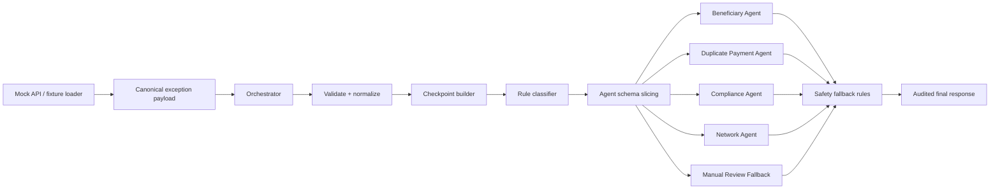

# Payment Exception Resolution Agent MVP Plan

This file is the 1.5-hour MVP plan. It is intentionally production-shaped, but still small enough to build quickly.

The team-proposed schemas were a good starting point. For the MVP, use the stronger schemas below so the prototype already demonstrates the right architecture: a canonical exception payload enters the orchestrator, then the orchestrator passes a scoped, agent-specific context to exactly one subagent.

## 1. MVP objective

Build a runnable prototype that demonstrates this flow:

```text
Mock API
  -> canonical payment exception JSON
  -> orchestrator validates, checkpoints, classifies, and slices context
  -> one isolated subagent investigates
  -> orchestrator applies safety fallback rules
  -> final decision response with trace, evidence, confidence, and next steps
```

The MVP only recommends actions. It must not move money, retry payments, cancel payments, release compliance holds, or contact clients.

## 2. MVP success criteria

The demo is successful if it can:

1. Accept a canonical payment exception payload from a mock API.
2. Classify into one of four categories: beneficiary, duplicate payment, compliance, or network.
3. Pass only the selected agent's scoped schema to the selected subagent.
4. Return a structured recommendation with confidence, evidence, rationale, checkpoints, and fallbacks.
5. Fail safely to manual review for invalid, ambiguous, low-confidence, or unsupported cases.
6. Run five sample cases: beneficiary, duplicate, compliance, network, and unknown fallback.

## 3. MVP architecture



## 4. Recommended MVP file structure

```text
payment_exception_mvp/
  app.py                         # FastAPI endpoint or CLI runner
  mock_api.py                    # Emits fixtures as if from an API
  orchestrator.py                # Validation, classification, schema slicing, fallbacks
  schemas.py                     # Pydantic or dataclass schemas
  checkpoints.py                 # Checkpoint helper
  agents/
    __init__.py
    beneficiary_agent.py
    duplicate_payment_agent.py
    compliance_agent.py
    network_agent.py
  fixtures/
    beneficiary_invalid.json
    duplicate_submission.json
    compliance_hold.json
    network_failure.json
    unknown_exception.json
  README.md
```

Fastest path: implement the CLI fixture runner first. Add FastAPI only after all fixtures pass end-to-end.

## 5. Canonical MVP input schema

The mock API should emit one canonical payload. This is the superset schema the orchestrator sees. Subagents never receive the entire payload.

```json
{
  "schema_version": "mvp-1.0",
  "event_id": "evt-001",
  "event_timestamp": "2026-06-09T06:00:01Z",
  "source_system": "mock-payment-api",
  "payment": {
    "payment_id": "pay-001",
    "client_id": "client-123",
    "client_reference": "INV-7788",
    "account_id": "acct-456",
    "payment_rail": "UPI",
    "payment_type": "OUTBOUND_TRANSFER",
    "amount": 12500.5,
    "currency": "INR",
    "submitted_timestamp": "2026-06-09T06:00:00Z",
    "current_transaction_status": "FAILED"
  },
  "beneficiary": {
    "beneficiary_id": "bene-789",
    "name": "Asha Rao",
    "account_number_masked": "XXXXXX7890",
    "ifsc": "HDFC0001234",
    "upi_id": "asha@upi",
    "country": "IN",
    "beneficiary_fingerprint": "benehash-abc123"
  },
  "exception": {
    "exception_code": "INVALID_BENEFICIARY",
    "exception_type_hint": "BENEFICIARY",
    "description": "Beneficiary validation failed",
    "severity": "MEDIUM"
  },
  "status_evidence": {
    "funds_movement_status": "NO_FUNDS_MOVED",
    "ledger_debit_status": "NOT_DEBITED",
    "network_finality": "FINAL_FAILED"
  },
  "beneficiary_validation": {
    "validation_status": "FAILED",
    "failed_fields": ["ifsc"],
    "suggested_correction": null,
    "validation_confidence": 0.91
  },
  "duplicate_evidence": {
    "duplicate_candidates": [],
    "payment_fingerprint": "client-123:12500.5:INR:benehash-abc123:INV-7788"
  },
  "compliance": {
    "compliance_hold_status": "NONE",
    "screening_result": "CLEAR",
    "screening_reference": null,
    "risk_flags": []
  },
  "network": {
    "network_acknowledgements": [],
    "rail_health_status": "AVAILABLE",
    "rail_incident_id": null
  },
  "history": {
    "prior_retry_events": [],
    "client_contact_history": []
  },
  "policy": {
    "automation_mode": "RECOMMENDATION_ONLY",
    "manual_review_threshold": 0.75,
    "safe_retry_threshold": 0.97,
    "duplicate_cancel_threshold": 0.95,
    "beneficiary_repair_threshold": 0.98
  }
}
```

### Why this is better than the minimum schema

| Improvement | Why it matters |
|---|---|
| `schema_version` | Lets the API evolve without breaking agents |
| `event_id` | Enables idempotency and replay |
| Nested `payment`, `beneficiary`, `exception` objects | Keeps fields organized and easier to validate |
| `status_evidence` | Prevents unsafe retry when funds movement is unclear |
| `beneficiary_validation` | Gives the beneficiary agent actual validation evidence |
| `duplicate_evidence` | Gives the duplicate agent candidate data instead of guessing from retries only |
| `compliance` | Separates compliance state from general exception fields |
| `network` | Makes network acknowledgements and rail health explicit |
| `history` | Keeps retry and client-contact history isolated |
| `policy` | Makes thresholds visible and configurable |

## 6. Shared agent input envelope

Every subagent receives a scoped input with the same envelope and a different `context` object.

```json
{
  "schema_version": "mvp-agent-1.0",
  "trace_id": "trace-evt-001",
  "case_id": "case-pay-001",
  "event_id": "evt-001",
  "payment_id": "pay-001",
  "agent_task_id": "task-beneficiary-pay-001",
  "agent_name": "BeneficiaryAgent",
  "created_at": "2026-06-09T06:00:02Z",
  "policy": {
    "automation_mode": "RECOMMENDATION_ONLY",
    "manual_review_threshold": 0.75
  },
  "context": {}
}
```

Common envelope fields:

| Field | Purpose |
|---|---|
| `schema_version` | Version the agent contract |
| `trace_id` | End-to-end observability |
| `case_id` | Case correlation |
| `event_id` | Idempotency and replay |
| `payment_id` | Payment correlation |
| `agent_task_id` | Specific subagent invocation tracking |
| `agent_name` | Expected subagent identity |
| `created_at` | Snapshot creation time |
| `policy` | Thresholds and automation mode available to the agent |
| `context` | Agent-specific, scoped data only |

## 7. Agent-specific MVP schemas

### 7.1 Beneficiary Agent input schema

Purpose: determine whether the payment exception is caused by invalid, missing, or mismatched beneficiary details.

```json
{
  "schema_version": "mvp-agent-1.0",
  "trace_id": "trace-evt-001",
  "case_id": "case-pay-001",
  "event_id": "evt-001",
  "payment_id": "pay-001",
  "agent_task_id": "task-beneficiary-pay-001",
  "agent_name": "BeneficiaryAgent",
  "created_at": "2026-06-09T06:00:02Z",
  "policy": {
    "automation_mode": "RECOMMENDATION_ONLY",
    "manual_review_threshold": 0.75,
    "beneficiary_repair_threshold": 0.98
  },
  "context": {
    "payment_summary": {
      "client_id": "client-123",
      "payment_rail": "UPI",
      "amount": 12500.5,
      "currency": "INR",
      "current_transaction_status": "FAILED",
      "funds_movement_status": "NO_FUNDS_MOVED"
    },
    "exception": {
      "exception_code": "INVALID_BENEFICIARY",
      "description": "Beneficiary validation failed"
    },
    "beneficiary": {
      "beneficiary_id": "bene-789",
      "name": "Asha Rao",
      "account_number_masked": "XXXXXX7890",
      "ifsc": "HDFC0001234",
      "upi_id": "asha@upi",
      "country": "IN",
      "beneficiary_fingerprint": "benehash-abc123"
    },
    "beneficiary_validation": {
      "validation_status": "FAILED",
      "failed_fields": ["ifsc"],
      "suggested_correction": null,
      "validation_confidence": 0.91
    },
    "client_contact_history": []
  }
}
```

Key improvement over the minimum schema: include amount, currency, client ID, funds movement status, and validation evidence. These fields let the agent avoid unsafe repair recommendations.

MVP rules:

- Missing required beneficiary identifier -> `REQUEST_CLIENT_CORRECTION`.
- Validation failed and no deterministic correction -> `REQUEST_CLIENT_CORRECTION`.
- Deterministic correction exists, confidence is at least `beneficiary_repair_threshold`, and funds did not move -> `RECOMMEND_REPAIR`.
- Funds movement is `UNKNOWN` or status is not final failed -> `MANUAL_REVIEW`.
- Existing unresolved client outreach -> `MANUAL_REVIEW` or `FOLLOW_UP_CLIENT_CONTACT` if that action is implemented.

### 7.2 Duplicate Payment Agent input schema

Purpose: identify duplicate submissions and avoid double payment.

```json
{
  "schema_version": "mvp-agent-1.0",
  "trace_id": "trace-evt-002",
  "case_id": "case-pay-002",
  "event_id": "evt-002",
  "payment_id": "pay-002",
  "agent_task_id": "task-duplicate-pay-002",
  "agent_name": "DuplicatePaymentAgent",
  "created_at": "2026-06-09T06:01:02Z",
  "policy": {
    "automation_mode": "RECOMMENDATION_ONLY",
    "manual_review_threshold": 0.75,
    "duplicate_cancel_threshold": 0.95
  },
  "context": {
    "payment_summary": {
      "client_id": "client-123",
      "client_reference": "INV-7788",
      "amount": 12500.5,
      "currency": "INR",
      "submitted_timestamp": "2026-06-09T06:01:00Z",
      "current_transaction_status": "PENDING",
      "funds_movement_status": "UNKNOWN"
    },
    "beneficiary_fingerprint": "benehash-abc123",
    "duplicate_evidence": {
      "payment_fingerprint": "client-123:12500.5:INR:benehash-abc123:INV-7788",
      "duplicate_candidates": [
        {
          "payment_id": "pay-001",
          "submitted_timestamp": "2026-06-09T06:00:00Z",
          "current_transaction_status": "COMPLETED",
          "match_score": 0.98,
          "matched_fields": ["client_id", "amount", "currency", "beneficiary_fingerprint", "client_reference"]
        }
      ]
    },
    "prior_retry_events": []
  }
}
```

Key improvement over the minimum schema: include currency, client reference, payment fingerprint, duplicate candidate details, match score, and funds movement status. This avoids guessing from timestamp and retry history alone.

MVP rules:

- Candidate match score is at least `duplicate_cancel_threshold`, original is completed, and current payment is not final -> `CANCEL_DUPLICATE` recommendation.
- Candidate exists but either payment has unknown status -> `HOLD_AND_RECONCILE`.
- Multiple strong candidates -> `MANUAL_REVIEW`.
- Missing amount, currency, client ID, beneficiary fingerprint, or timestamp -> `MANUAL_REVIEW`.

### 7.3 Compliance / Sanctions Agent input schema

Purpose: detect compliance or sanctions constraints and force safe escalation.

```json
{
  "schema_version": "mvp-agent-1.0",
  "trace_id": "trace-evt-003",
  "case_id": "case-pay-003",
  "event_id": "evt-003",
  "payment_id": "pay-003",
  "agent_task_id": "task-compliance-pay-003",
  "agent_name": "ComplianceAgent",
  "created_at": "2026-06-09T06:02:02Z",
  "policy": {
    "automation_mode": "RECOMMENDATION_ONLY",
    "manual_review_threshold": 0.75,
    "compliance_auto_release_allowed": false
  },
  "context": {
    "payment_summary": {
      "client_id": "client-123",
      "payment_rail": "WIRE",
      "amount": 250000.0,
      "currency": "USD",
      "origin_country": "US",
      "destination_country": "AE",
      "current_transaction_status": "HELD"
    },
    "beneficiary": {
      "beneficiary_id": "bene-999",
      "name": "Global Trading LLC",
      "country": "AE",
      "beneficiary_fingerprint": "benehash-risk-999"
    },
    "exception": {
      "exception_code": "SANCTIONS_REVIEW",
      "description": "Payment requires sanctions screening review"
    },
    "compliance": {
      "compliance_hold_status": "SANCTIONS_REVIEW",
      "screening_result": "POTENTIAL_MATCH",
      "screening_reference": "screen-555",
      "risk_flags": ["POTENTIAL_SANCTIONS_MATCH", "HIGH_VALUE_PAYMENT"]
    }
  }
}
```

Key improvement over the minimum schema: include origin and destination country, screening result, screening reference, risk flags, current status, and a policy flag that forbids auto-release.

MVP rules:

- Any non-`NONE` compliance hold -> `ESCALATE_COMPLIANCE`.
- Screening result is `POTENTIAL_MATCH`, `MATCH`, `AML_REVIEW`, or `POLICY_HOLD` -> `ESCALATE_COMPLIANCE`.
- Automation is always disabled.
- Never recommend retry, release, repair, or cancel from this agent.

### 7.4 Network / Payment Rail Failure Agent input schema

Purpose: handle timeout, no acknowledgement, rail outage, and uncertain finality cases.

```json
{
  "schema_version": "mvp-agent-1.0",
  "trace_id": "trace-evt-004",
  "case_id": "case-pay-004",
  "event_id": "evt-004",
  "payment_id": "pay-004",
  "agent_task_id": "task-network-pay-004",
  "agent_name": "NetworkAgent",
  "created_at": "2026-06-09T06:03:02Z",
  "policy": {
    "automation_mode": "RECOMMENDATION_ONLY",
    "manual_review_threshold": 0.75,
    "safe_retry_threshold": 0.97,
    "max_retry_attempts": 1
  },
  "context": {
    "payment_summary": {
      "payment_rail": "UPI",
      "amount": 12500.5,
      "currency": "INR",
      "submitted_timestamp": "2026-06-09T06:03:00Z",
      "current_transaction_status": "UNKNOWN",
      "funds_movement_status": "UNKNOWN"
    },
    "exception": {
      "exception_code": "NETWORK_TIMEOUT",
      "description": "No final acknowledgement received before timeout"
    },
    "network": {
      "rail_health_status": "DEGRADED",
      "rail_incident_id": "incident-upi-123",
      "network_acknowledgements": [
        {
          "ack_id": "ack-1",
          "ack_type": "SUBMITTED",
          "ack_status": "ACCEPTED_BY_GATEWAY",
          "received_at": "2026-06-09T06:03:02Z",
          "is_final": false
        }
      ]
    },
    "retry_history": {
      "prior_retry_events": [],
      "retry_count": 0,
      "last_retry_status": null
    }
  }
}
```

Key improvement over the minimum schema: include amount, currency, funds movement status, rail health, incident ID, finality flag on acknowledgements, retry count, and safe retry threshold.

MVP rules:

- Status is `UNKNOWN` or funds movement is `UNKNOWN` -> `HOLD_AND_RECONCILE`.
- Rail health is `DEGRADED` or `DOWN` -> `WAIT_FOR_NETWORK_RECOVERY`.
- Final failure acknowledgement exists, retry count is 0, and funds did not move -> `RECOMMEND_SAFE_RETRY`, but automation disabled.
- Prior retry with unknown result -> `HOLD_AND_RECONCILE`.

## 8. Common subagent output schema

Every subagent returns the same response shape.

```json
{
  "agent_name": "BeneficiaryAgent",
  "classification": "incorrect_beneficiary",
  "action": "REQUEST_CLIENT_CORRECTION",
  "automation_allowed": false,
  "confidence": 0.88,
  "risk_level": "MEDIUM",
  "reason_codes": ["INVALID_BENEFICIARY", "CLIENT_INPUT_REQUIRED"],
  "evidence": [
    "beneficiary_validation.validation_status=FAILED",
    "beneficiary_validation.failed_fields=[ifsc]",
    "status_evidence.funds_movement_status=NO_FUNDS_MOVED"
  ],
  "fallbacks_triggered": [],
  "explanation": "Beneficiary validation failed and no deterministic correction is available. Client correction is required before resubmission.",
  "next_steps": [
    "Create client outreach task",
    "Ask client to confirm beneficiary IFSC or UPI details",
    "Do not retry until corrected details are received"
  ]
}
```

Required output fields:

| Field | Purpose |
|---|---|
| `agent_name` | Confirms which subagent produced the decision |
| `classification` | Domain classification |
| `action` | Recommended operational action |
| `automation_allowed` | Always false for MVP financial actions |
| `confidence` | Numeric confidence from 0.0 to 1.0 |
| `risk_level` | `LOW`, `MEDIUM`, `HIGH`, or `CRITICAL` |
| `reason_codes` | Machine-readable decision reasons |
| `evidence` | Human-readable evidence facts |
| `fallbacks_triggered` | Safety degradations used |
| `explanation` | Plain-English rationale |
| `next_steps` | Operational follow-up |

## 9. Orchestrator classification rules

Use deterministic rules first. Do not use an LLM classifier for the 1.5-hour MVP.

Priority order:

1. If `compliance.compliance_hold_status != NONE`, or `exception.exception_code` contains `COMPLIANCE`, `SANCTIONS`, `AML`, or `POLICY`, choose `ComplianceAgent`.
2. Else if `exception.exception_code` contains `DUPLICATE`, or `duplicate_evidence.duplicate_candidates` is non-empty, choose `DuplicatePaymentAgent`.
3. Else if `exception.exception_code` contains `BENEFICIARY`, `INVALID_ACCOUNT`, `INVALID_IFSC`, `INVALID_UPI`, or `NAME_MISMATCH`, choose `BeneficiaryAgent`.
4. Else if `exception.exception_code` contains `NETWORK`, `TIMEOUT`, `NO_ACK`, `RAIL_UNAVAILABLE`, or `DOWNSTREAM`, choose `NetworkAgent`.
5. Else choose `ManualReviewFallback`.

## 10. Safety fallback rules

The orchestrator must apply these after the subagent returns:

| Condition | Override |
|---|---|
| Compliance signal exists | Force `ESCALATE_COMPLIANCE` |
| Agent confidence below manual review threshold | Force `MANUAL_REVIEW` unless the agent already chose hold or escalation |
| Agent recommends retry but duplicate evidence exists | Force `HOLD_AND_RECONCILE` |
| Agent recommends retry but funds movement is unknown | Force `HOLD_AND_RECONCILE` |
| Agent recommends repair but beneficiary validation confidence is low | Force `REQUEST_CLIENT_CORRECTION` or `MANUAL_REVIEW` |
| Agent output schema invalid | Force `MANUAL_REVIEW` |
| Agent throws error | Force `MANUAL_REVIEW` |
| Unsupported exception type | Force `MANUAL_REVIEW` |

MVP safety principle:

```text
Recommendation-only mode. If uncertain, hold or escalate. Never auto-retry, auto-cancel, auto-repair, or auto-release.
```

## 11. Checkpoints

Every response should include these checkpoints:

1. `request_received`
2. `canonical_schema_validated`
3. `payload_normalized`
4. `idempotency_key_created`
5. `classification_started`
6. `classification_completed`
7. `agent_selected`
8. `agent_input_sliced`
9. `agent_input_schema_validated`
10. `agent_invocation_started`
11. `agent_completed` or `agent_failed`
12. `agent_output_validated`
13. `safety_fallbacks_evaluated`
14. `final_decision_created`
15. `response_emitted`

Example:

```json
{
  "name": "agent_input_schema_validated",
  "status": "passed",
  "details": "NetworkAgent input contained only network-scoped context and common envelope fields"
}
```

## 12. Final orchestrator response schema

```json
{
  "trace_id": "trace-evt-001",
  "case_id": "case-pay-001",
  "event_id": "evt-001",
  "payment_id": "pay-001",
  "classification": "incorrect_beneficiary",
  "selected_agent": "BeneficiaryAgent",
  "decision": {
    "action": "REQUEST_CLIENT_CORRECTION",
    "automation_allowed": false,
    "confidence": 0.88,
    "risk_level": "MEDIUM",
    "reason_codes": ["INVALID_BENEFICIARY", "CLIENT_INPUT_REQUIRED"]
  },
  "evidence": [
    "beneficiary_validation.validation_status=FAILED",
    "beneficiary_validation.failed_fields=[ifsc]"
  ],
  "checkpoints": [
    {"name": "request_received", "status": "passed"},
    {"name": "canonical_schema_validated", "status": "passed"},
    {"name": "classification_completed", "status": "passed"},
    {"name": "agent_completed", "status": "passed"},
    {"name": "response_emitted", "status": "passed"}
  ],
  "fallbacks_triggered": [],
  "explanation": "Beneficiary validation failed and no deterministic correction is available.",
  "next_steps": [
    "Create client outreach task",
    "Do not retry until corrected beneficiary details are received"
  ]
}
```

## 13. MVP exception handling

| Exception case | Behavior |
|---|---|
| Malformed JSON | Return 400 or CLI validation failure |
| Missing top-level section | Return manual review with `canonical_schema_invalid` |
| Missing required agent context | Do not call agent, return `MANUAL_REVIEW` |
| Ambiguous classification | Use priority order and record `ambiguous_classification_resolved` |
| Unknown classification | Return `MANUAL_REVIEW` |
| Agent timeout or crash | Return `MANUAL_REVIEW` with `agent_failed` checkpoint |
| Agent invalid output | Return `MANUAL_REVIEW` with `agent_output_invalid` |
| Duplicate `event_id` | Return cached response if in-memory idempotency is implemented |
| Low confidence | Manual review unless the action is a conservative hold or compliance escalation |

## 14. 90-minute implementation schedule

| Time | Task | Output |
|---:|---|---|
| 0-10 min | Create project structure, fixtures, and schema constants | Files and sample JSON |
| 10-25 min | Implement canonical payload validation and CLI runner | Payload reaches orchestrator |
| 25-40 min | Implement classifier, schema slicing, and checkpoints | Correct agent selected per fixture |
| 40-65 min | Implement four subagents | Each fixture returns expected decision |
| 65-75 min | Add safety fallback layer and output validation | Unsafe decisions get overridden |
| 75-85 min | Add README and clean demo output | Repeatable demo command |
| 85-90 min | Run smoke tests and prepare explanation | Demo ready |

## 15. Smoke tests

| Test | Expected result |
|---|---|
| Invalid beneficiary fixture | `BeneficiaryAgent`, `REQUEST_CLIENT_CORRECTION` |
| Duplicate fixture with confirmed original | `DuplicatePaymentAgent`, `CANCEL_DUPLICATE` recommendation |
| Compliance hold fixture | `ComplianceAgent`, `ESCALATE_COMPLIANCE`, automation false |
| Network timeout fixture | `NetworkAgent`, `HOLD_AND_RECONCILE` |
| Unknown exception fixture | `ManualReviewFallback`, `MANUAL_REVIEW` |
| Network retry requested with duplicate evidence | Orchestrator overrides to `HOLD_AND_RECONCILE` |
| Missing required context | Orchestrator returns `MANUAL_REVIEW` before calling agent |

## 16. Demo talking points

- We used a canonical event schema instead of four unrelated payloads.
- The orchestrator owns classification, routing, checkpoints, and safety fallbacks.
- Each subagent receives only the context it needs, but enough context to avoid unsafe recommendations.
- The compliance agent fails closed.
- Duplicate and network agents prevent unsafe retry behavior.
- The MVP is recommendation-only, but the schema already supports future production side effects and auditability.
